# Laboratório 01 - Configuração inicial no PNetLab

**Disciplina:** ENE0025 - Protocolos de Transporte e Roteamento  
**Aluno:** Artur Kohara Guerra  
**Matrícula:** 231025181

---

## Objetivos do laboratório

- Compreender que redes distintas **não se comunicam automaticamente**
- Identificar o **papel do roteador** como elemento lógico de interconexão
- Diferenciar falha de comunicação por ausência de roteamento de falha física
- Relacionar teoria de roteamento com comportamento real da rede

---

## Cenário do Laboratório

### Topologia no PNETLab

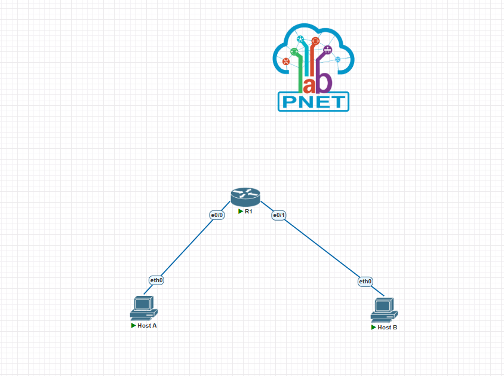

---

## Recursos no PNetLab

- Router ou SW L3 (Cisco IOL layer 3)
- 2 hosts VPC
- 2 segmentos Ethernet

---

## Testes de conectividade sem roteamento

Esta primeira parte consiste em configurar os dispositivos da rede de forma que cada um seja capaz de se comunicar com o roteador (switch layer 3), mas não sejam capazes de comunicar entre si.
Ou seja, o objetivo é estruturar uma conectividade sem roteamento (gateway).

---

### Endereçamento proposto

| Dispositivo | Interface | IP            | Máscara |
| ----------- | --------- | ------------- | ------- |
| Host A      | eth0      | 192.168.10.10 | /24     |
| Router      | eth0      | 192.168.10.1  | /24     |
| Router      | eth1      | 192.168.20.1  | /24     |
| Host B      | eth0      | 192.168.20.10 | /24     |

---

### Configuração dos hosts

- Configuração no Host A

  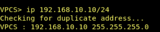

- Configuração no Host B

  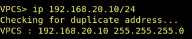

---

### Configuração do roteador

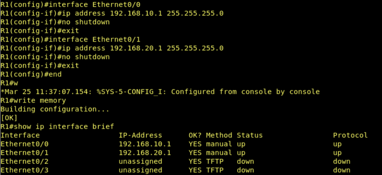

---

### Testes

- Host A

  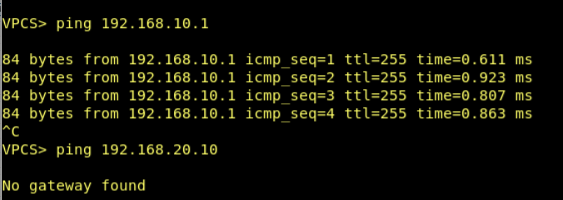

- Host B

  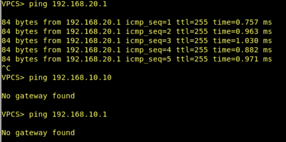

---

### Discussão orientada

- **O enlace físico funciona?**

  Sim, o enlace físico funciona. Isso pode ser verificado pelo fato que o Host A consegue comunicar com o roteador (ping 192.168.10.1) e o Host B também (ping 192.168.20.1).

  Dessa forma, percebe-se que as interfaces estão ativas e as conexões estão corretas.

- **O IP está configurado corretamente?**

  Sim, os IPs estão configurados corretamente. Cada dispositivo está em sua respectiva rede.

- **Por que o pacote não chega ao Host B?**

  O pacote não chega ao Host B, pois o Host A não sabe onde está a rede 192.168.20.0. O Host A não possui um gateway configurado ainda, então, ele apenas conhece a sua própria rede (192.168.10.0/24).

  Portanto, quando o Host A tenta enviar um pacote para o endereço IP 192.168.20.10 (Host B), ele identifica que esse IP não faz parte de sua rede local e descarta o pacote. Ou seja, a falha de comunicação não ocorre por problema físico ou de endereçamento, mas sim pela ausência de uma decisão de roteamento.

---

## Introdução da decisão de roteamento

Esta segunda parte do laboratório consiste em configurar os gateways dos hosts para que haja conexão entre eles por meio de roteamento.

A topologia e os endereçamentos são os mesmos da primeira parte.

---

### Configuração de gateway padrão nos hosts

- Host A

  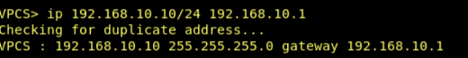

- Host B

  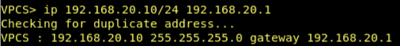

---

### Novos testes de conectividade

- Host A

  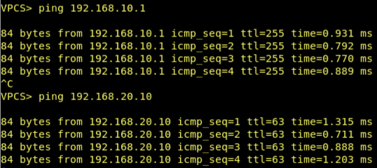

- Host B

  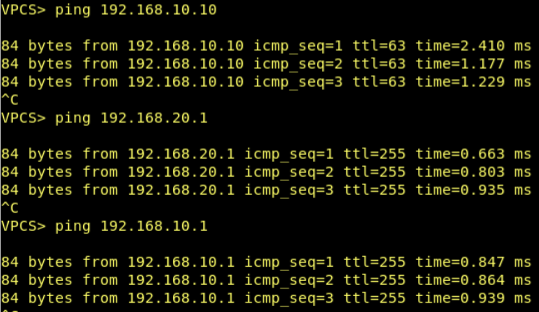

---

### Observação das tabelas de rotas

- Host A

  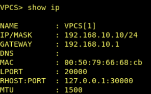

- Host B

  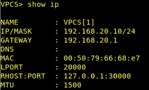

Observa-se agora que cada dispositivo da rede (hosts e roteador) possui uma tabela de roteamento própria. Dessa forma, quando os hosts precisam enviar um pacote para fora de sua rede local, eles encaminham para o roteador.

Como, na topologia utilizada, as duas redes são diretamente conectadas pelo roteador, ele faz o encaminhamento entre essas redes locais, permitindo que os hosts conectem entre si.

Ou seja, a comunicação na rede ocorre de forma distribuída, onde cada dispositivo toma decisões de encaminhamento com base apenas em sua própria tabela de rotas.

---

### Discussão final orientada

- **O roteador conhece o caminho completo?**

  Nessa topologia em específico, o roteador sabe o caminho completo, pois esta é uma rede bem simples com apenas um roteador conectando dois hosts, ou seja, o roteador e suas rotas são o caminho completo da rede entre os hosts.

- **Onde ocorreu a “inteligência” da rede?**

  A "inteligência" da rede está distribuída entre os dispositivos, ocorrendo localmente em cada nó, onde cada um toma decisões com base em informações locais.

  Os hosts tomam a decisão de enviar os pacotes ao gateway quando o destino não pertence às suas respectivas redes locais e o roteador decide para onde encaminhar os pacotes com base em sua tabela de roteamento.

- **O que aconteceria com mais roteadores?**

  Com a adição de mais roteadores, a rede se tornaria mais complexa. Os roteadores deixariam de saber o caminho completo da rede e suas tabelas de roteamento seriam, agora, apenas uma parte dos caminhos totais da rede.

  Dessa maneira, a "inteligência" da rede ficaria ainda mais distribuída, onde cada roteador contruiria suas tabelas no plano de controle, por meio de um processo chamado de roteamento, definindo os caminhos possíveis em cada roteador, e faria o envio dos pacotes no plano de dados, utilizando suas respectivas tabelas de roteamento, por meio de um processo chamado de encaminhamento.
