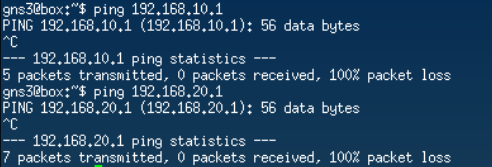
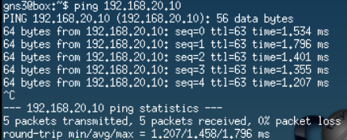
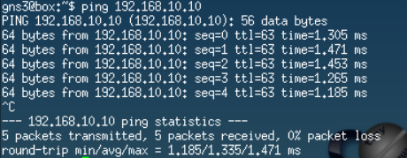
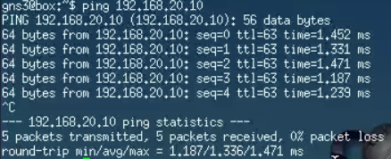
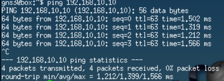
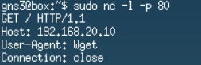
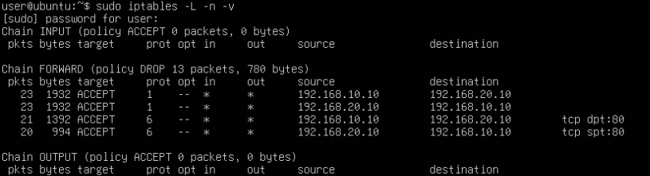
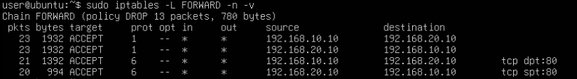
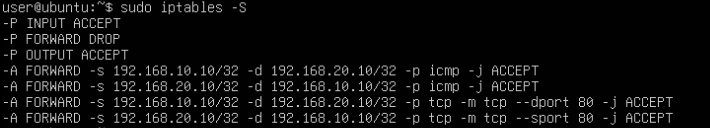

Disciplina: **ENE0025 – Protocolos de Transporte e Roteamento**  
Curso: **Engenharia de Redes de Comunicação**  
Instituição: **Universidade de Brasília (UnB)**  
Departamento: **Engenharia Elétrica**

Professor Responsável: **Prof. Dr. Laerte Peotta de Melo**

# Relatório do Laboratório 10

## Identificação

- Nome: **Artur Kohara Guerra**
- Matrícula: **231025181**
- Turma: **01**

---

## Objetivo

Implementar um **firewall de pacotes** em uma máquina Linux no PNetLab, posicionada entre **duas máquinas Linux básicas**, aplicando regras com `iptables` para controlar o tráfego entre duas redes distintas com base em endereço IP, protocolo e porta.

---

## Topologia do Laboratório


O Linux 1 e o Linux 2 agem como clientes na comunicação e a máquina linux central age como firewall.

---

## Procedimentos

### Configuração dos hosts Linux

#### Configuração no PNetLab

```bash
Image: linux-tinycore-6.4
Ethernet: 1
MTU: 1500
CPU: 1
RAM: 2048 MB
Console: VNC
Qemu Arch: x86_64
Qemu NIC: virtio-net-pci
TPM: Disabled
UEFI: desmarcado
```

---

#### Linux Cliente 1

Configuração do endereço IP e da rota padrão:

```bash
sudo ip addr add 192.168.10.10/24 dev eth0
sudo ip link set eth0 up
sudo ip route add default via 192.168.10.1
```

Verificando a configuração:


---

#### Linux Cliente 2

Configuração do endereço IP e da rota padrão:

```bash
sudo ip addr add 192.168.20.10/24 dev eth0
sudo ip link set eth0 up
sudo ip route add default via 192.168.20.1
```

Verificando a configuração:


---

### Configuração básica da máquina Linux Firewall

#### Configuração no PNetLab

```bash
Image: linux-ubuntu-24.04-server
Ethernet: 2
MTU: 1500
CPU: 2
RAM: 4096 MB
Console: VNC
Qemu Arch: x86_64
Qemu NIC: virtio-net-pci
TPM: Disabled
UEFI: desmarcado
Qemu options: -machine type=pc,accel=kvm -vga virtio -usbdevice tablet -boot order=cd -cpu host -k pt-br
```

---

#### Configuração dos endereços IP das interfaces

```bash
sudo ip addr add 192.168.10.1/24 dev ens3
sudo ip addr add 192.168.20.1/24 dev ens4
sudo ip link set ens3 up
sudo ip link set ens4 up
```

Verificando a configuração:


---

#### Ativação do roteamento IP

```bash
sudo sysctl -w net.ipv4.ip_forward=1
```

---

### Bloqueio de ping com `sysctl`

Nesta etapa, foi feito um teste simples para impedir que o firewall responda a requisições de ping.

```bash
sudo sysctl -w net.ipv4.icmp_echo_ignore_all=1
```

Teste:



Depois, reverteu-se a configuração.

```bash
sudo sysctl -w net.ipv4.icmp_echo_ignore_all=0
```

---

### Teste inicial sem firewall

- Cliente 1

  

- Cliente 2

  

---

### Limpeza das regras antigas

Antes de iniciar a configuração do firewall, limpou-se regras anteriores do `iptables`.

```bash
sudo iptables -F
sudo iptables -X
sudo iptables -Z
```

Definindo a política padrão da cadeia `FORWARD` como `DROP`. Dessa forma, qualquer outro tráfego não explicitamente permitido será bloqueado:

```bash
sudo iptables -P FORWARD DROP
```

---

### Configuração das regras do firewall de pacotes

Nesta etapa, foi permitido apenas:

- **ICMP** do Linux Cliente 1 para o Linux Cliente 2;
- **HTTP** do Linux Cliente 1 para o Linux Cliente 2;
- tráfego de retorno correspondente a essas permissões, de forma explícita.

---

#### Permitindo ICMP entre os dois hosts

```bash
sudo iptables -A FORWARD -s 192.168.10.10 -d 192.168.20.10 -p icmp -j ACCEPT
sudo iptables -A FORWARD -s 192.168.20.10 -d 192.168.10.10 -p icmp -j ACCEPT
```

---

#### Permitindo HTTP do Cliente 1 para o Cliente 2

```bash
sudo iptables -A FORWARD -s 192.168.10.10 -d 192.168.20.10 -p tcp --dport 80 -j ACCEPT
sudo iptables -A FORWARD -s 192.168.20.10 -d 192.168.10.10 -p tcp --sport 80 -j ACCEPT
```

---

### Testes práticos

#### Teste de ICMP

- Linux Cliente 1

  

- Linux Cliente 2

  

---

#### Teste de HTTP

No Cliente 2, utilizou-se o Netcat para simular um servidor HTTP na porta 80:



No Linux Cliente 1, testou-se o acesso:


Dessa maneira, percebe-se que o teste foi um sucesso, pois a conexão foi estabelecida.

---

#### Teste de Telnet não permitido

No Linux Cliente 1, como o telnet não estava disponível, foi utilizado novamente o Netcat:


Observa-se, portanto, que a conexão de fato falhou.

---

#### Teste de acesso iniciado pelo Cliente 2

No **Linux Cliente 2**, tentou-se iniciar conexão TCP para o Cliente 1 em uma porta qualquer com o Netcat.


Logo, nota-se que a conexão falhou, pois não há regra permitindo esse tráfego.

---

### Verificação das regras

- Regras com contadores

  

- Regras da cadeia FORWARD

  

- Regras em formato detalhado

  

---

## Questões para análise

- **1. O que caracteriza um firewall de pacotes?**

  Um firewall de pacotes analisa cada pacote de rede individualmente e decide se ele deve ser permitido ou bloqueado com base em informações presentes no cabeçalho do pacote, como endereço IP de origem e destino, protocolo e porta. Ele não acompanha o estado das conexões, tomando decisões apenas com base nas regras configuradas.

- **2. Quais campos do pacote foram usados nas regras deste laboratório?**

  As regras utilizaram os campos de endereço IP de origem (`-s`), endereço IP de destino (`-d`), protocolo (`-p`), porta de destino (`--dport`) e porta de origem (`--sport`)

- **3. Por que foi necessário ativar o IP forwarding no Linux?**

  Foi necessário ativar o IP forwarding para que o Linux pudesse encaminhar pacotes entre suas duas interfaces de rede. Sem essa funcionalidade, o sistema apenas receberia pacotes destinados a ele próprio, não atuando como roteador ou firewall entre as duas redes.

- **4. Qual é a função da cadeia `FORWARD` no `iptables`?**

  A cadeia `FORWARD` é responsável por processar pacotes que atravessam o host, ou seja, pacotes que entram por uma interface e saem por outra. Em um firewall ou roteador Linux, essa cadeia controla quais comunicações entre redes diferentes serão permitidas ou bloqueadas.

- **5. Por que o tráfego não permitido foi bloqueado mesmo sem regras específicas para todos os protocolos?**

  O tráfego não permitido foi bloqueado mesmo sem regras específicas, pois a política padrão da cadeia FORWARD foi configurada como DROP. Dessa forma, qualquer pacote que não correspondesse a uma regra explícita de permissão seria automaticamente descartado pelo firewall.

- **6. Qual a diferença entre permitir HTTP e permitir ICMP?**

  Permitir HTTP significa autorizar conexões TCP destinadas à porta 80, utilizadas para serviços web. Já permitir ICMP significa autorizar mensagens de controle e diagnóstico da rede, como as utilizadas pelo comando `ping`.

- **7. O que muda quando a política padrão da cadeia `FORWARD` é `DROP`?**

  Quando a política padrão é `DROP`, todo tráfego é bloqueado por padrão. Apenas os pacotes que corresponderem a regras explícitas de permissão serão encaminhados. Essa abordagem aumenta a segurança ao seguir o princípio de negar tudo e permitir apenas o necessário.

- **8. Por que esse laboratório ainda não é considerado um firewall stateful?**

  Esse laboratório ainda não é considerado um firewall stateful, pois as regras analisam cada pacote isoladamente e não acompanham o estado das conexões. Foi necessário criar regras específicas para o tráfego de ida e para o tráfego de retorno. Em um firewall stateful, o sistema reconhece conexões já estabelecidas e permite automaticamente os pacotes de resposta associados a elas.

- **9. Qual a importância da ordem das regras no `iptables`?**

  O `iptables` processa as regras de cima para baixo. Quando um pacote corresponde a uma regra, a ação definida é executada e as regras seguintes não são analisadas. Por isso, a ordem das regras é fundamental para garantir que o tráfego seja tratado corretamente e que regras mais específicas não sejam sobrescritas por regras mais gerais.

- **10. Quais vantagens práticas surgem ao usar hosts Linux básicos no lugar de VPCs neste laboratório?**

  O uso de hosts Linux permite realizar testes mais realistas, pois oferece ferramentas como `ping`, `wget`, `curl`, `nc`, servidores HTTP e outras aplicações de rede. Além disso, possibilita observar o comportamento dos serviços, analisar portas, gerar tráfego real e validar as regras do firewall de forma mais completa do que seria possível com VPCs simples.

- **11. Qual a diferença entre bloquear o ping com `sysctl` e bloquear ICMP com `iptables`?**

  O parâmetro `sysctl` utilizado (`net.ipv4.icmp_echo_ignore_all`) impede que o próprio sistema operacional responda a requisições de ping destinadas ao firewall. Já o `iptables` permite controlar o tráfego ICMP que atravessa ou chega ao sistema com muito mais flexibilidade, podendo filtrar pacotes com base em origem, destino, interfaces e outros critérios. Assim, o `sysctl` altera o comportamento do host, enquanto o `iptables` atua como mecanismo de filtragem de pacotes.

---

## Conclusão

Neste laboratório foi possível implementar e testar um firewall de pacotes utilizando o `iptables` em uma máquina Linux atuando como intermediária entre duas redes distintas. Foram configurados o endereçamento IP, o encaminhamento de pacotes por meio do IP forwarding e regras de filtragem baseadas em endereço IP, protocolo e porta. Os testes realizados demonstraram o funcionamento correto das permissões para tráfego ICMP e HTTP, bem como o bloqueio de conexões não autorizadas. Dessa forma, o laboratório permitiu compreender na prática como um firewall de pacotes controla o tráfego entre redes e como políticas de segurança baseadas no princípio de "negar por padrão e permitir apenas o necessário" contribuem para aumentar a segurança da infraestrutura de rede.
