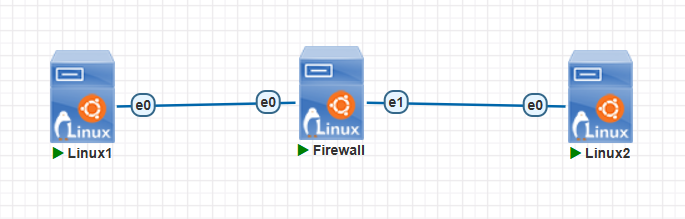
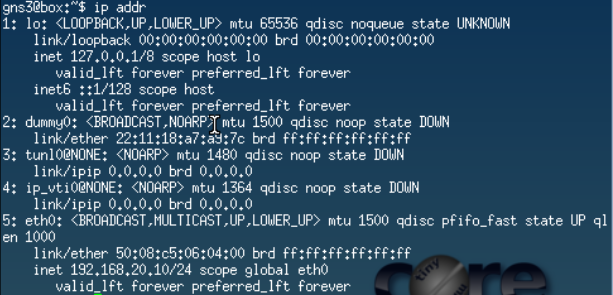
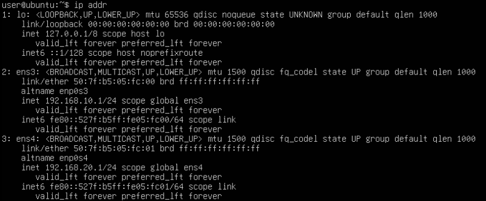
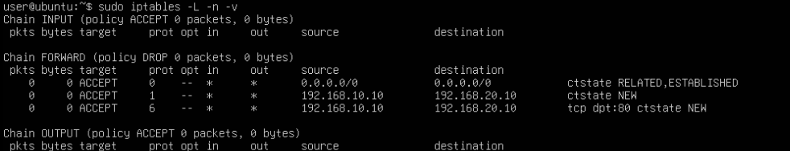
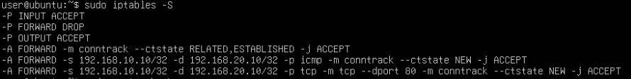
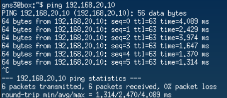
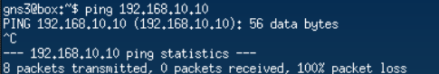
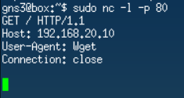

Disciplina: **ENE0025 – Protocolos de Transporte e Roteamento**  
Curso: **Engenharia de Redes de Comunicação**  
Instituição: **Universidade de Brasília (UnB)**  
Departamento: **Engenharia Elétrica**

Professor Responsável: **Prof. Dr. Laerte Peotta de Melo**

# Relatório do Laboratório 10B

## Identificação

- Nome: **Artur Kohara Guerra**
- Matrícula: **231025181**
- Turma: **01**

---

## Objetivo

Implementar um **firewall stateful** em uma máquina Linux no PNetLab , reutilizando a topologia do **Laboratório 10**, com regras baseadas em **estado de conexão** para permitir automaticamente o tráfego de retorno de sessões já autorizadas.

---

## Topologia do Laboratório

A topologia utilizada é a mesma do Laboratório 10.



---

## Procedimentos

### Veirificação da configuração IP

- Cliente 1
  

- Cliente 2
  

- Firewall
  

---

### Limpeza inicial do firewall

```bash
sudo iptables -F
sudo iptables -X
sudo iptables -Z
sudo iptables -P FORWARD DROP
```

---

### Regra central do firewall statefull

```bash
sudo iptables -A FORWARD -m conntrack --ctstate ESTABLISHED,RELATED -j ACCEPT
```

Essa regra permite:

- pacotes que pertencem a conexões já aceitas;
- pacotes relacionados a conexões existentes.

---

### Regras de novas conexões iniciadas pelo Cliente 1

#### Permitir ICMP iniciado pelo Cliente 1

```bash
sudo iptables -A FORWARD -s 192.168.10.10 -d 192.168.20.10 -p icmp -m conntrack --ctstate NEW -j ACCEPT
```

---

#### Permitir HTTP iniciado pelo Cliente 1

```bash
sudo iptables -A FORWARD -s 192.168.10.10 -d 192.168.20.10 -p tcp --dport 80 -m conntrack --ctstate NEW -j ACCEPT
```

---

### Verificação das regras





---

### Testes práticos

#### Teste de icmp

- No Linux Cliente 1:

  

  Nota-se que essa conexão funcionou, como esperado.

- No Linux Cliente 2:

  

  Observa-se que essa conexão falhou, como esperado.

---

#### Teste de HTTP

No Cliente 2, utilizou-se o Netcat para simular um servidor HTTP na porta 80:



No Linux Cliente 1, testou-se o acesso:


Dessa maneira, percebe-se que o teste foi um sucesso, pois a conexão foi estabelecida.

---

#### Teste de nova conexão iniciada pelo Cliente 2


Verifica-se que a conexão falhou, como esperado.

---

#### Teste de Telnet não permitido


Percebe-se que a conexão falhou, como esperado.

---

## Comparação entre firewall de pacotes (Laboratório 10) e firewall stateful (Laboratório 10B)

No Laboratório 10 foi implementado um firewall de pacotes utilizando o `iptables`, no qual cada pacote é analisado individualmente com base em critérios como endereço IP, protocolo e porta. Nesse modelo, o firewall não possui conhecimento sobre o estado das conexões, sendo necessário criar regras explícitas tanto para o tráfego de ida quanto para o tráfego de retorno.

Já no Laboratório 10B foi implementado um firewall stateful utilizando o mecanismo de rastreamento de conexões (`conntrack`). Nesse caso, o firewall passou a acompanhar o estado das conexões, permitindo automaticamente os pacotes pertencentes a sessões já estabelecidas por meio da regra `ESTABLISHED,RELATED`. Como consequência, houve uma redução significativa na quantidade de regras necessárias e uma simplificação da política de segurança.

| Teste                                | Laboratório 10 - Filtro de pacotes                                      | Laboratório 10B - Stateful                                                                                     |
| ------------------------------------ | ----------------------------------------------------------------------- | -------------------------------------------------------------------------------------------------------------- |
| Ping iniciado pelo Cliente 1         | Funciona devido às regras ICMP explícitas de ida e volta.               | Funciona porque a conexão é iniciada pelo Cliente 1 e o retorno é permitido automaticamente por `ESTABLISHED`. |
| Retorno da comunicação               | Necessita regra explícita para o tráfego de retorno.                    | É permitido automaticamente pela regra `ESTABLISHED,RELATED`.                                                  |
| HTTP Cliente 1 → Cliente 2           | Funciona, mas exige regra para a conexão de ida e outra para o retorno. | Funciona com apenas uma regra para a conexão nova; o retorno é permitido automaticamente.                      |
| Nova conexão iniciada pelo Cliente 2 | Foi bloqueada, pois não existe regra permitindo essa conexão.           | Não funciona, pois apenas conexões `NEW` iniciadas pelo Cliente 1 são permitidas.                              |
| Quantidade de regras                 | Maior, pois é necessário criar regras para ida e volta de cada serviço. | Menor, pois uma única regra `ESTABLISHED,RELATED` trata automaticamente o retorno das conexões.                |
| Facilidade de administração          | Menor, devido à necessidade de manter várias regras explícitas.         | Maior, pois a política fica mais simples, organizada e escalável.                                              |

---

## Questões para análise

- 1. O que diferencia um firewall stateful de um firewall de pacotes simples?

  Um firewall de pacotes simples analisa cada pacote individualmente com base em informações no header, como endereço IP, protocolo e porta, sem considerar o contexto da comunicação. Já um firewall stateful acompanha o estado das conexões e consegue identificar se um pacote pertence a uma sessão já estabelecida, permitindo um controle mais inteligente do tráfego.

- 2. Qual a função de `-m conntrack --ctstate ESTABLISHED,RELATED`?

  Essa regra utiliza o mecanismo de rastreamento de conexões do Linux para permitir pacotes pertencentes a conexões já estabelecidas (`ESTABLISHED`) ou relacionadas a elas (`RELATED`). Dessa forma, o tráfego de resposta de uma comunicação autorizada é aceito automaticamente sem necessidade de regras adicionais.

- 3. Por que o retorno da conexão HTTP não precisou de regra explícita no sentido inverso?

  Isso ocorreu, pois o firewall stateful reconheceu que os pacotes de resposta pertenciam a uma conexão já estabelecida. A regra ESTABLISHED,RELATED permitiu automaticamente esse tráfego de retorno, eliminando a necessidade de criar uma regra específica para o fluxo inverso.

- 4. O que caracteriza um pacote no estado `NEW`?

  Um pacote no estado `NEW` é aquele que inicia uma nova comunicação ou conexão. No contexto do laboratório, os pacotes enviados pelo Cliente 1 para iniciar uma sessão HTTP ou ICMP foram classificados como `NEW`, sendo avaliados pelas regras que permitem novas conexões.

- 5. Qual a principal vantagem de usar regras stateful em relação ao Laboratório 10?

  A principal vantagem é a redução da quantidade de regras necessárias. Como o firewall acompanha o estado das conexões, o tráfego de retorno é tratado automaticamente, simplificando a configuração da política de segurança.

- 6. Por que o Cliente 2 não conseguiu iniciar novas conexões para o Cliente 1?

  Porque as regras do firewall permitiam apenas conexões classificadas como `NEW` originadas pelo Cliente 1. Como não existia nenhuma regra autorizando novas conexões iniciadas pelo Cliente 2, os pacotes foram bloqueados pela política padrão da cadeia `FORWARD`, configurada como `DROP`.

- 7. O que mudou na quantidade e na lógica das regras entre Laboratório 10 e Laboratório 10B?

  No Laboratório 10 foi necessário criar regras separadas para o tráfego de ida e de volta de cada serviço permitido. Já no Laboratório 10B uma única regra para conexões ESTABLISHED,RELATED passou a tratar automaticamente o retorno das comunicações, reduzindo a quantidade de regras.

- 8. Em que tipo de ambiente um firewall stateful tende a ser mais adequado?

  Firewalls stateful são mais adequados para ambientes corporativos, redes empresariais, data centers e redes com grande quantidade de usuários e conexões simultâneas. Nesses cenários, o acompanhamento do estado das conexões aumenta a eficiência da filtragem e simplifica a administração das políticas de segurança.

- 9. O firewall stateful elimina a necessidade de política de bloqueio padrão? Explique.

  Não. Mesmo em um firewall stateful, a política de bloqueio padrão continua sendo importante para garantir que todo tráfego não autorizado seja descartado. O rastreamento de conexões apenas facilita o tratamento das comunicações válidas, mas ainda é necessário definir quais novas conexões podem ser iniciadas e bloquear o restante do tráfego.

- 10. O que a atividade comparativa mostrou de forma mais clara sobre a diferença entre os dois modelos?

  A atividade comparativa mostrou que o firewall de pacotes exige regras explícitas para cada direção da comunicação, enquanto o firewall stateful utiliza o rastreamento de conexões para permitir automaticamente o tráfego de retorno de sessões autorizadas. Isso reduz a quantidade de regras necessárias, simplifica a configuração e torna a política de segurança mais eficiente e fácil de administrar.

## Conclusão

Neste laboratório foi possível implementar e analisar o funcionamento de um firewall stateful utilizando o `iptables` e o mecanismo de rastreamento de conexões (`conntrack`) em uma máquina Linux atuando como firewall entre duas redes distintas. Por meio dos testes realizados, observou-se que o firewall passou a reconhecer conexões já estabelecidas, permitindo automaticamente o tráfego de retorno sem a necessidade de regras explícitas para cada direção da comunicação. A comparação com o Laboratório 10 evidenciou que o modelo stateful reduz a quantidade de regras necessárias, simplifica a administração da política de segurança e torna o controle de tráfego mais eficiente. Dessa forma, conclui-se que os firewalls stateful oferecem uma solução mais prática e adequada para ambientes reais, mantendo a segurança da rede ao mesmo tempo em que facilitam a gestão das comunicações autorizadas.
