Disciplina: **ENE0025 – Protocolos de Transporte e Roteamento**  
Curso: **Engenharia de Redes de Comunicação**  
Instituição: **Universidade de Brasília (UnB)**  
Departamento: **Engenharia Elétrica**

Professor Responsável: **Prof. Dr. Laerte Peotta de Melo**

# Relatório do Laboratório 11A

## Identificação

- Nome: **Artur Kohara Guerra**
- Matrícula: **231025181**
- Turma: **01**

---

## Objetivo

Implementar um **Web Application Firewall (WAF)** em uma máquina Linux no PNetLab, utilizando **Nginx + ModSecurity + OWASP Core Rule Set (CRS)** em modo de **proxy reverso**, de forma que o tráfego HTTP entre um cliente e um servidor web interno seja inspecionado e controlado na **camada de aplicação**.

Dessa forma, deve ser possível:

- compreender a função de um WAF;
- diferenciar WAF de firewall de pacotes e firewall stateful;
- implantar um proxy reverso com inspeção HTTP;
- validar acesso legítimo a uma aplicação web;
- observar o ponto de inserção do WAF na arquitetura da rede.

---

## Topologia do Laboratório

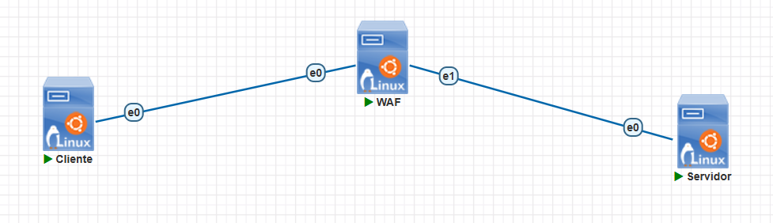

A topologia consiste em um cliente, um servidor web interno e um **WAF**, sendo que são todos máquinas Linux Ubuntu 24.04 server.

---

## Procedimentos

### Configuração dos hosts

Para configurar os IPs dos hosts, foi utilizado o netplan para manter salvas as configurações.

- Cliente

  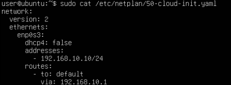

- Servidor Web Interno

  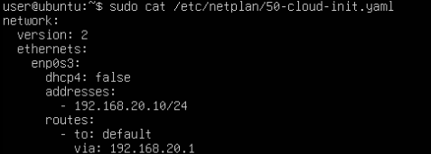

- WAF

  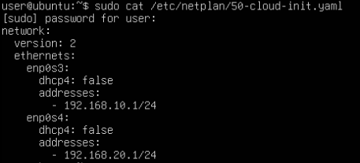

Para aplicar as configurações utiliza-se o comando:

```bash
sudo netplan apply
```

---

### Ativação do roteamento IP no WAF

Embora o WAF opere principalmente como proxy reverso, é recomendável manter o host preparado para encaminhamento entre interfaces quando necessário.

```bash
sudo sysctl -w net.ipv4.ip_forward=1
```

---

### Teste inicial de conectividade

Antes da implantação do WAF, foi validada a conectividade entre os hosts.

- Cliente

  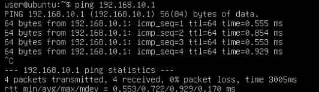

- Servidor

  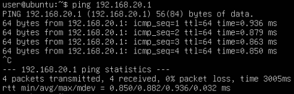

- WAF

  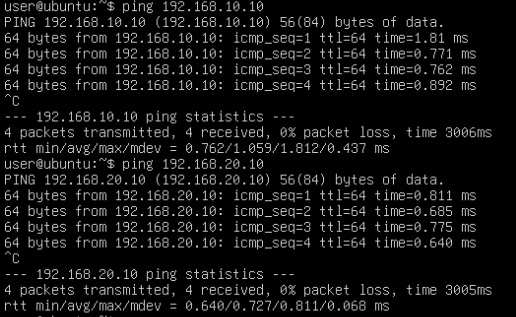

---

### Preparação do servidor web interno

No servidor web interno, instalou-se um serviço HTTP simples, nesse caso, foi utilizado o nginx.

```bash
sudo apt update
sudo apt install -y nginx
```

Após isso, criou-se uma página simples:

```bash
echo "<h1>Servidor Web Interno OK</h1>" | sudo tee /var/www/html/index.html
```

Verificou-se o serviço usando os seguintes comandos:

```bash
sudo systemctl enable nginx
sudo systemctl start nginx
sudo systemctl status nginx
```

Por fim, foi feito um teste local no próprio servidor

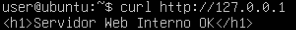

---

### Instalação do Nginx no host WAF

No Linux WAF:

```bash
sudo apt update
sudo apt install -y nginx
```

Verificação usando os comandos:

```bash
sudo systemctl enable nginx
sudo systemctl start nginx
sudo systemctl status nginx
```

---

### Instalação do ModSecurity no host WAF

Foi instalado o módulo do ModSecurity e componentes necessários:

```bash
sudo apt install -y libnginx-mod-http-modsecurity modsecurity-crs
```

---

### Habilitação do ModSecurity

O arquivo de configuração padrão do ModSecurity não estava no caminho esperado pelo roteiro do
laboratório. Ele foi localizado em `/usr/share/nginx/docs/modsecurity/modsecurity.conf` e
copiado para o diretório correto:

```bash
sudo cp /usr/share/nginx/docs/modsecurity/modsecurity.conf /etc/modsecurity/modsecurity.conf
```

Editou-se o parâmetro `SecRuleEngine DetectionOnly` dentro do arquivo, alterando ele para `SecRuleEngine On`.

---

### Ativação do OWASP CRS

Foi verificado a localização do arquivo `crs-setup.conf`, porém, como ele já estava presente em `/etc/modsecurity/crs/crs-setup.conf` , não foi necessária nenhuma cópia adicional.

---

### Configuração do Nginx como proxy reverso com WAF

Editou-se a configuração do site padrão do Nginx no WAF:

```bash
sudo vi /etc/nginx/sites-available/default
```

Substituindo seu conteúdo pela seguinte configuração:

```nginx
server {
    listen 80;
    server_name _;

    modsecurity on;
    modsecurity_rules_file /etc/nginx/modsec/main.conf;

    location / {
        proxy_pass http://192.168.20.10;
        proxy_set_header Host $host;
        proxy_set_header X-Real-IP $remote_addr;
        proxy_set_header X-Forwarded-For $proxy_add_x_forwarded_for;
    }
}
```

---

### Arquivo principal de regras do Nginx + ModSecurity

Foi criado o arquivo com os seguintes comandos:

```bash
sudo mkdir -p /etc/nginx/modsec
sudo vi /etc/nginx/modsec/main.conf
```

Colocou-se o seguinte conteúdo nesse arquivo:

```conf
Include /etc/modsecurity/modsecurity.conf
Include /usr/share/modsecurity-crs/crs-setup.conf
Include /usr/share/modsecurity-crs/rules/*.conf
```

---

### Teste e recarga do Nginx

Verificou-se a sintaxe:

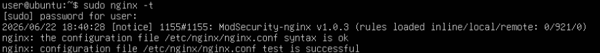

Se estiver correto:

```bash
sudo systemctl restart nginx
```

Verificou-se o serviço:

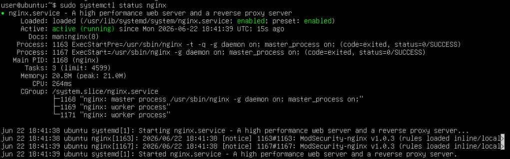

---

### Teste funcional do proxy reverso

No **Linux Cliente**, foi feito o acesso ao IP do WAF:

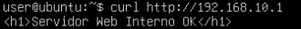

Percebe-se que o cliente recebe a página hospedada no servidor web interno com sucesso, nesse caso, via WAF.

---

### Teste comparativo de acesso direto e indireto

Agora, foi feito um acesso direto ao backend, ao invés de usar o WAF, para comparar os dois casos.

Se houver rota direta, teste:

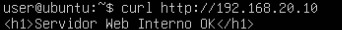

Nota-se que, em ambos os casos, o clinete recebeu a página do servidor web interno corretamente. No entanto, o acesso correto para publicação deve ser via **WAF**, pois o backend idealmente deve ficar menos exposto ao cliente. Dessa maneira o WAF passa a ser o ponto principal de entrada para o serviço web.

---

### Verificação de logs

- Logs do Nginx

  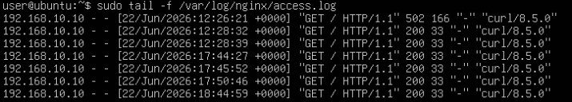

  Nesse caso, há vários logs registrados, pois foram feitos vários testes para verificar a correta implementação do laboratório.

  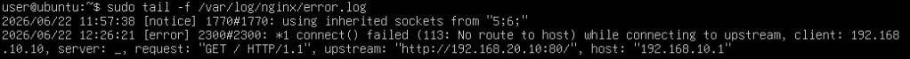

  Nesse caso, há alguns erros registrados, pois houveram alguns erros e problemas ao longo dos testes e desenvolvimento do laboratório, mas eles foram todos resolvidos.

- Logs do ModSecurity

  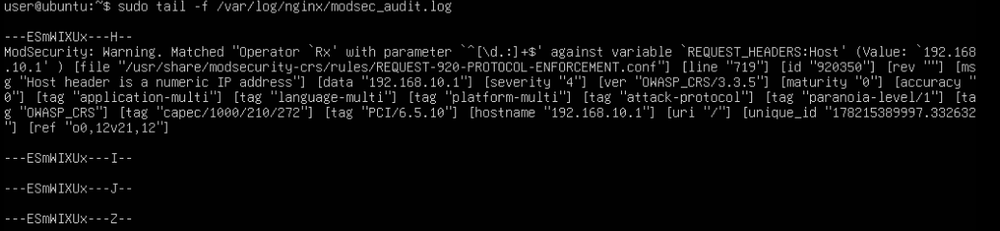

---

## Questões para análise

- **1. O que caracteriza um WAF?**

  Um **Web Application Firewall (WAF)** é um mecanismo de segurança projetado para proteger aplicações web por meio da inspeção e filtragem do tráfego HTTP e HTTPS. Diferentemente de firewalls tradicionais, que analisam apenas informações de rede e transporte, um WAF compreende elementos da camada de aplicação, como URLs, parâmetros, cabeçalhos e conteúdo das requisições. Isso permite identificar e bloquear ataques direcionados a aplicações web, como SQL Injection, Cross-Site Scripting (XSS) e Path Traversal.

- **2. Qual é a principal diferença entre um WAF e um firewall stateful?**

  A principal diferença está na camada de atuação. Um firewall stateful opera principalmente nas camadas de rede e transporte, analisando endereços IP, portas, protocolos e o estado das conexões. Já um WAF atua na camada de aplicação, inspecionando o conteúdo das requisições HTTP e HTTPS. Dessa forma, enquanto o firewall stateful verifica se uma conexão é válida, o WAF verifica se o conteúdo dessa conexão representa uma ameaça à aplicação web.

- **3. Por que o WAF é mais adequado para proteger aplicações web do que um firewall tradicional?**

  O WAF é mais adequado porque consegue analisar o conteúdo das requisições enviadas à aplicação. Um firewall tradicional pode permitir o acesso à porta 80 ou 443 sem verificar o que está sendo transmitido. Já o WAF inspeciona URLs, parâmetros e dados enviados pelos usuários, sendo capaz de detectar e bloquear padrões de ataques específicos contra aplicações web, mesmo quando a conexão é legítima do ponto de vista da rede.

- **4. Qual é a função do ModSecurity neste laboratório?**

  O ModSecurity atua como o mecanismo de inspeção do WAF. Ele intercepta as requisições e respostas HTTP que passam pelo Nginx e aplica regras de segurança para identificar comportamentos suspeitos ou maliciosos. Quando uma regra é acionada, o ModSecurity pode registrar o evento, gerar alertas ou bloquear a requisição, dependendo da configuração utilizada.

- **5. Qual é a função do OWASP CRS?**

  O **OWASP Core Rule Set (CRS)** é um conjunto de regras de segurança pré-definidas para o ModSecurity. Sua função é fornecer proteção contra vulnerabilidades e ataques comuns em aplicações web, como SQL Injection, XSS, execução remota de código e manipulação maliciosa de parâmetros. Dessa forma, o administrador não precisa criar todas as regras manualmente, podendo utilizar uma base amplamente testada e mantida pela comunidade OWASP.

- **6. O que significa operar o WAF como proxy reverso?**

  Operar o WAF como proxy reverso significa posicioná-lo entre os clientes e o servidor web interno. Nesse modelo, os clientes enviam suas requisições ao WAF, que as analisa e, caso sejam consideradas legítimas, encaminha elas ao servidor backend. As respostas retornam pelo mesmo caminho. Assim, o cliente interage com o WAF e não diretamente com o servidor web real.

- **7. Por que o acesso ao backend deve preferencialmente ocorrer por meio do WAF?**

  Quando o acesso ocorre exclusivamente pelo WAF, todas as requisições passam por uma camada adicional de inspeção e proteção antes de chegar ao servidor web. Isso reduz a exposição direta do backend à rede, dificulta ataques e permite a aplicação centralizada de políticas de segurança. Caso o backend seja acessado diretamente, as proteções fornecidas pelo WAF podem ser contornadas.

- **8. Que vantagens práticas surgem ao separar cliente, WAF e servidor web em redes distintas?**

  A separação em redes distintas proporciona maior organização e segurança da infraestrutura. Essa segmentação facilita o controle de tráfego, reduz a superfície de ataque e permite aplicar políticas específicas para cada segmento da rede. Além disso, o servidor web interno fica isolado da rede dos clientes, tornando mais difícil o acesso direto a recursos críticos e facilitando o monitoramento e a administração da arquitetura.

- **9. O WAF substitui a necessidade de firewall de rede? Explique.**

  O WAF não substitui a necessidade de um firewall de rede, pois o WAF e o firewall de rede possuem funções complementares. O firewall de rede continua sendo necessário para controlar o acesso com base em endereços IP, protocolos e portas, enquanto o WAF protege especificamente aplicações web por meio da análise do conteúdo HTTP e HTTPS.

- **10. Qual a principal evolução conceitual entre os Labs 10, 10B e 11A?**

  A evolução ocorreu no nível de profundidade da inspeção realizada sobre o tráfego. No Lab 10, foi utilizado um firewall de pacotes, que toma decisões com base em IPs, portas e protocolos. No Lab 10B, foi introduzido o conceito de firewall stateful, que acompanha o estado das conexões para permitir decisões mais inteligentes. Já no Lab 11A, a proteção foi elevada para a camada de aplicação por meio de um WAF, capaz de analisar o conteúdo das requisições HTTP e identificar ataques específicos contra aplicações web.

---

## Conclusão

Neste laboratório foi implementado um Web Application Firewall utilizando Nginx, ModSecurity e OWASP CRS em modo de proxy reverso. A atividade demonstrou como a proteção de aplicações web exige mecanismos mais avançados do que os oferecidos por firewalls tradicionais e stateful. Ao inspecionar o conteúdo das requisições HTTP, o WAF adiciona uma camada de defesa capaz de identificar e bloquear ataques direcionados às aplicações, complementando as técnicas de segurança estudadas nos laboratórios anteriores.
