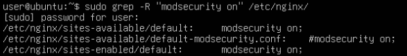
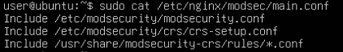
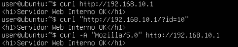
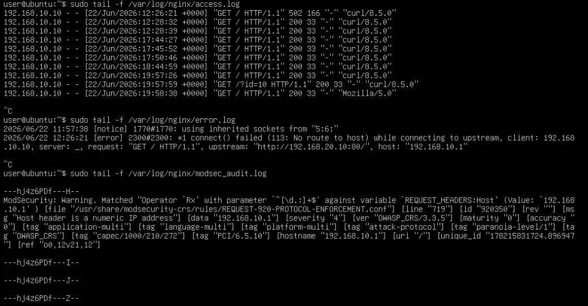
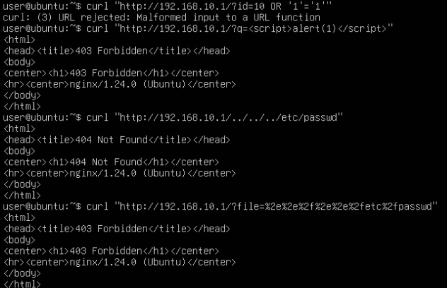
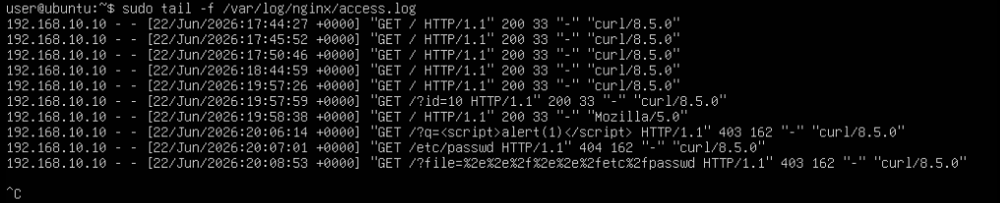
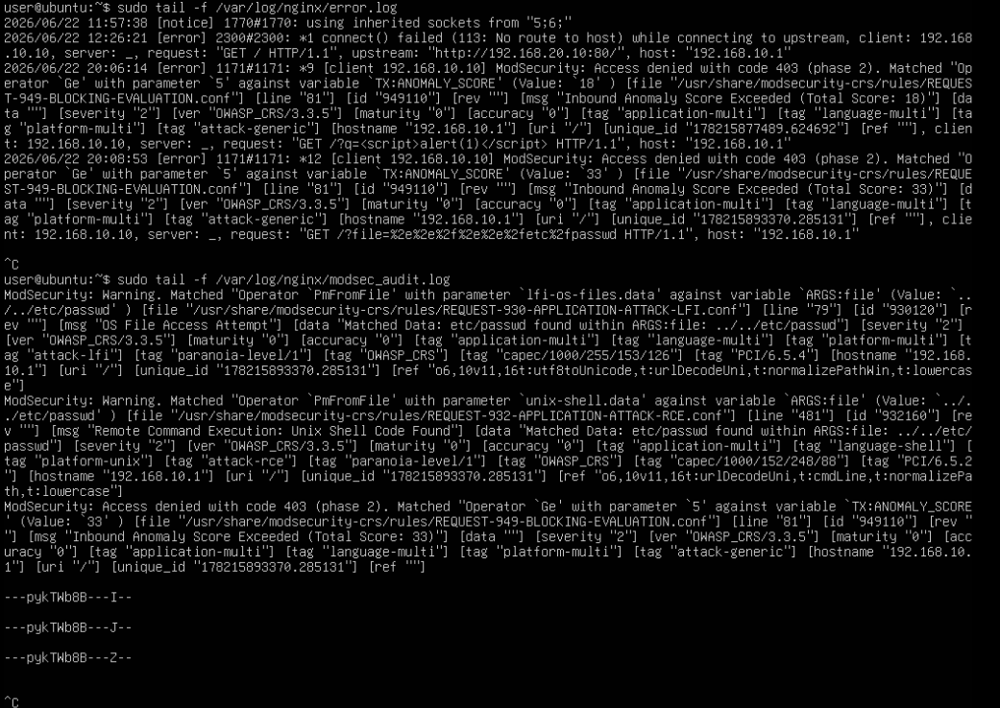
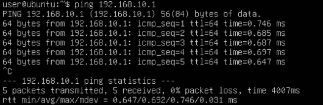
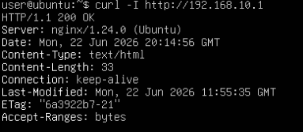

Disciplina: **ENE0025 – Protocolos de Transporte e Roteamento**  
Curso: **Engenharia de Redes de Comunicação**  
Instituição: **Universidade de Brasília (UnB)**  
Departamento: **Engenharia Elétrica**

Professor Responsável: **Prof. Dr. Laerte Peotta de Melo**

# Relatório do Laboratório 11B

## Identificação

- Nome: **Artur Kohara Guerra**
- Matrícula: **231025181**
- Turma: **01**

---

## Objetivo

Dar continuidade ao **Lab 11A**, realizando testes controlados de requisições HTTP legítimas e maliciosas contra o ambiente protegido por **Nginx + ModSecurity + OWASP CRS**, de modo que seja possível:

- observar o comportamento do WAF diante de tráfego normal e suspeito;
- identificar bloqueios gerados por regras do OWASP CRS;
- analisar logs do Nginx e do ModSecurity;
- compreender, na prática, a diferença entre:
  - firewall de pacotes;
  - firewall stateful;
  - WAF.

---

## Topologia do Laboratório


A topologia é a mesma utilizada no Laboratório 11A.

---

## Procedimentos

### Validação inicial do ambiente

Antes dos testes de ataque, foi verificado que o ambiente está operacional.

- No servidor web interno

  

- No cliente, via WAF

  

---

### Verificação dos serviços no WAF


Foi verificado se o ModSecurity está ativo no Nginx:



Verificou-se o arquivo principal de regras:



---

### Testes de tráfego legítimo

Foram feitos os seguintes testes de tráfego legítimo no cliente:

- Acesso normal à página inicial

  ```bash
  curl http://192.168.10.1
  ```

- Acesso com parâmetro simples

  ```bash
  curl "http://192.168.10.1/?id=10"
  ```

- Acesso com user-agent comum

  ```bash
  curl -A "Mozilla/5.0" http://192.168.10.1
  ```

Dessa forma, obtivemos os seguintes resultados:

- No Cliente:

  

- Logs no WAF:
  

Portanto, nota-se que todos os testes foram permitidos sem nenhum tipo de bloqueio.

Os logs de erro e de Modsecurity que aparecem aqui são residuais de problemas que ocorreram durante a confecção do Laboratório 11A.

---

### Testes controlados de requisições suspeitas

Agora foram feitos os seguintes testes de requisições suspeitas com o cliente:

- Teste de padrão semelhante a SQL Injection

  ```bash
  curl "http://192.168.10.1/?id=1' OR '1'='1"
  ```

- Teste de padrão semelhante a XSS

  ```bash
  curl "http://192.168.10.1/?q=<script>alert(1)</script>"
  ```

- Teste de path traversal

  ```bash
  curl "http://192.168.10.1/../../../etc/passwd"
  ```

- Teste com URL codificada

  ```bash
  curl "http://192.168.10.1/?file=%2e%2e%2f%2e%2e%2fetc%2fpasswd"
  ```

Assim sendo, foram obtidos os seguintes resultados:

- No Cliente:

  

- Logs no WAF:

  

  

Logo, observa-se que esses acessos suspeitos foram todos bloqueados ou invalidados pelo WAF.

---

### Comparação prática: rede funcionando, aplicação bloqueada

- Verificar que a conectividade IP continua válida

  No cliente:

  

- Verificar que a porta HTTP continua publicada

  

Ou seja, percebe-se que:

- a rede está operacional;
- a sessão TCP pode ser estabelecida;
- a porta 80 está acessível;
- mesmo assim, a requisição pode ser barrada por causa do conteúdo HTTP, como foi evidenciado nos testes.

---

### Tabela comparativa entre os modelos de firewall

| Situação                                               | Firewall de pacotes | Firewall stateful | WAF           |
| ------------------------------------------------------ | ------------------- | ----------------- | ------------- |
| Liberar ou bloquear TCP/80                             | Libera              | Libera            | Libera        |
| Acompanhar conexão já estabelecida                     | Não                 | Sim               | Indiretamente |
| Analisar conteúdo da URL                               | Não                 | Não               | Sim           |
| Identificar padrão de XSS                              | Não                 | Não               | Sim           |
| Identificar padrão de SQLi                             | Não                 | Não               | Sim           |
| Bloquear requisição web suspeita sem fechar a porta 80 | Não                 | Não               | Sim           |

---

### Análise de logs

#### Requisições legítimas

Foram observadas as seguintes entradas nas imagens dos teste:

```bash
192.168.10.10 - - [22/Jun/2026:19:57:59 +0000] "GET / HTTP/1.1" 200 33 "-" "curl/8.5.0"

192.168.10.10 - - [22/Jun/2026:19:57:59 +0000] "GET /?id=10 HTTP/1.1" 200 33 "-" "curl/8.5.0"

192.168.10.10 - - [22/Jun/2026:19:58:38 +0000] "GET / HTTP/1.1" 200 33 "-" "Mozilla/5.0"
```

A partir dessas entradas foi possível identificar:

| Campo            | Valor                           |
| ---------------- | ------------------------------- |
| Horário          | 22/Jun/2026 entre 19:57 e 19:58 |
| IP de origem     | 192.168.10.10                   |
| Recurso acessado | `/` e `/?id=10`                 |
| Código HTTP      | 200 OK                          |
| User-Agent       | curl/8.5.0 e Mozilla/5.0        |

Esses resultados demonstram que o WAF permitiu o tráfego considerado legítimo, encaminhando as requisições ao servidor backend e retornando normalmente o conteúdo solicitado.

---

#### Teste de padrão semelhante a SQL Injection

Esse teste foi barrado pelo próprio curl do cliente, pois a url da requisição é inválida, uma vez que possui caracteres especiais, como o espaço e as aspas simples, que precisam ser codificados. Dessa forma, esse teste nem sequer chegou a ser enviado pelo cliente e não gerou logs no WAF.

---

#### Teste de padrão semelhante a XSS

No access.log foi registrada a entrada, como pode ser visto na imagem dos testes:

```bash
192.168.10.10 - - [22/Jun/2026:20:06:14 +0000]
"GET /?q=<script>alert(1)</script> HTTP/1.1"
403 162
```

Assim sendo, foram identificadas as seguintes informações:

| Campo            | Valor                           |
| ---------------- | ------------------------------- |
| Horário          | 22/Jun/2026 20:06:14            |
| IP de origem     | 192.168.10.10                   |
| Recurso acessado | `/?q=<script>alert(1)</script>` |
| Código HTTP      | 403 Forbidden                   |

O código HTTP 403 indica que a requisição foi bloqueada antes de chegar ao servidor web interno.

No arquivo error.log foi encontrado o seguinte registro:

```bash
ModSecurity: Access denied with code 403
```

Além disso, foi registrada a regra `[id "949110"]`, com a mensagem `Inbound Anomaly Score Exceeded (Total Score: 18)`. Isso indica que a pontuação de anomalia calculada pelo CRS ultrapassou o limite configurado, levando ao bloqueio automático da requisição.

---

#### Teste de path traversal

O servidor retornou o código HTTP 404 (Not Found), indicando que o recurso solicitado não foi localizado. Diferentemente do teste de Path Traversal codificado, que gerou bloqueio explícito pelo ModSecurity com código HTTP 403, esta tentativa não apresentou evidências de acionamento das regras do OWASP CRS nos logs coletados. Apesar disso, o ataque não teve sucesso, pois o servidor não disponibilizava o recurso solicitado. O resultado demonstra que nem toda tentativa de ataque necessariamente gera um bloqueio do WAF, em alguns casos a própria aplicação ou servidor pode impedir o acesso por outros mecanismos, resultando em erro de recurso inexistente.

---

#### Teste com URL codificada

No access.log foi registrada:

```bash
192.168.10.10 - - [22/Jun/2026:20:08:53 +0000]
"GET /?file=%2e%2e%2f%2e%2e%2fetc%2fpasswd HTTP/1.1"
403 162
```

Foram identificadas as seguintes informações:

| Campo            | Valor                                   |
| ---------------- | --------------------------------------- |
| Horário          | 22/Jun/2026 20:08:53                    |
| IP de origem     | 192.168.10.10                           |
| Recurso acessado | `/?file=%2e%2e%2f%2e%2e%2fetc%2fpasswd` |
| Código HTTP      | 403 Forbidden                           |

Novamente a requisição foi bloqueada pelo WAF.

---

#### Regras acionadas pelo ModSecurity

A análise do arquivo `modsec_audit.log` revelou as regras responsáveis pelo bloqueio.

- Regra 930120

  ```bash
  [id "930120"]
  ```

  Mensagem:

  ```bash
  OS File Access Attempt
  ```

  Essa regra pertence ao arquivo `REQUEST-930-APPLICATION-ATTACK-LFI.conf` e sua função é detectar tentativas de acesso a arquivos do sistema operacional por meio de ataques do tipo Local File Inclusion (LFI) ou Path Traversal.

- Regra 932160

  ```bash
  [id "932160"]
  ```

  Mensagem:

  ```bash
  Remote Command Execution: Unix Shell Code Found
  ```

  O ModSecurity identificou padrões compatíveis com tentativas de execução de comandos ou acesso indevido ao sistema operacional através dos parâmetros da URL.

- Regra 949110

  ```bash
  [id "949110"]
  ```

  Mensagem:

  ```bash
  Inbound Anomaly Score Exceeded
  ```

  Esta é a regra responsável pela decisão final de bloqueio.

  O OWASP CRS utiliza um sistema de pontuação de anomalias. Cada regra acionada adiciona pontos ao escore da requisição. Quando o valor acumulado ultrapassa o limite configurado, a regra `949110` entra em ação e bloqueia a requisição.

  Nos testes realizados foram observados valores, como `Total Score: 18` e `Total Score: 33`, ambos acima do limite permitido.

---

## Questões para análise

- **1. O que diferencia um WAF de um firewall stateful?**

  A principal diferença está na camada de atuação. Um firewall stateful opera principalmente nas camadas de rede e transporte, analisando endereços IP, portas, protocolos e o estado das conexões. Já um WAF atua na camada de aplicação, inspecionando o conteúdo das requisições HTTP e HTTPS. Dessa forma, enquanto o firewall stateful verifica se uma conexão é válida, o WAF verifica se o conteúdo dessa conexão representa uma ameaça à aplicação web.

- **2. Por que a requisição pode ser bloqueada mesmo com a porta 80 aberta?**

  A porta 80 aberta significa apenas que o serviço HTTP está acessível e que a conexão TCP pode ser estabelecida. Entretanto, após receber a requisição, o WAF analisa seu conteúdo. Caso identifique padrões considerados maliciosos, ele pode bloquear a requisição retornando um erro HTTP, mesmo que a comunicação de rede esteja funcionando normalmente.

- **3. O que o WAF consegue observar que o `iptables` não observa?**

  O `iptables` trabalha principalmente com informações das camadas de rede e transporte, como IP de origem, IP de destino, protocolo e portas.

  O WAF consegue observar elementos da camada de aplicação, incluindo: URL requisitada, parâmetros enviados na URL, cabeçalhos HTTP, corpo das requisições, cookies e padrões associados a ataques web.

  Por exemplo, o `iptables` não consegue identificar a presença de um código JavaScript malicioso em uma URL, enquanto o WAF consegue detectar e bloquear esse tipo de conteúdo.

- **4. Qual foi o comportamento do ambiente diante de tráfego legítimo?**

  As requisições consideradas legítimas foram permitidas normalmente pelo WAF. Os acessos à página inicial, ao parâmetro simples ?id=10 e ao acesso utilizando um navegador identificado como Mozilla foram encaminhados ao servidor web interno e retornaram código HTTP 200 (OK).

  Essas requisições também foram registradas normalmente nos logs do Nginx sem gerar alertas ou bloqueios no ModSecurity.

- **5. Qual foi o comportamento do ambiente diante de tráfego suspeito?**

  As requisições contendo padrões suspeitos foram analisadas pelo ModSecurity em conjunto com o OWASP CRS. Nos testes realizados, as tentativas de XSS e de Path Traversal codificado foram identificadas como potencialmente maliciosas e bloqueadas pelo WAF, retornando código HTTP 403 (Forbidden).

  Além do bloqueio, foram gerados registros detalhados nos logs de auditoria do ModSecurity, contendo informações sobre as regras acionadas e os motivos do bloqueio.

- **6. O que os logs do Nginx mostram?**

  Os logs do Nginx registram todas as requisições recebidas pelo proxy reverso. Neles é possível identificar informações como: horário da requisição, endereço IP de origem, recurso acessado, método HTTP utilizado, código de resposta retornado e agente de usuário (User-Agent).

- **7. O que os logs do ModSecurity mostram?**

  Os logs do ModSecurity registram eventos relacionados à inspeção de segurança realizada pelo WAF. Eles apresentam informações como: regra acionada, descrição da ameaça detectada, pontuação de anomalia, parâmetros analisados, IP de origem e horário da ocorrência.

- **8. Um bloqueio HTTP significa necessariamente falha da rede? Explique.**

  Um bloqueio HTTP não significa necessariamente que existe um problema de conectividade na rede.

  Durante o laboratório foi possível verificar que os testes de XSS e Path Traversal foram bloqueados pelo WAF com código HTTP 403, mesmo com a rede funcionando normalmente, o endereço IP acessível e a porta 80 aberta.

  Isso demonstra que a conexão foi estabelecida corretamente, mas o conteúdo da requisição foi considerado inadequado e bloqueado pela política de segurança da aplicação.

- **9. O WAF substitui a necessidade de correção de vulnerabilidade na aplicação? Explique.**

  O WAF é uma camada adicional de proteção e não substitui o desenvolvimento seguro nem a correção das vulnerabilidades da aplicação.

  Embora ele consiga identificar e bloquear diversas tentativas de ataque, novas técnicas podem surgir ou algumas requisições maliciosas podem não ser detectadas. Por isso, a aplicação deve continuar sendo desenvolvida com boas práticas de segurança, validação de entradas, controle de acesso e correção de falhas conhecidas.

  O WAF deve ser visto como uma medida complementar de defesa, e não como a solução única para a segurança da aplicação.

- **10. Qual foi a principal evidência prática de que o WAF atua na camada de aplicação?**

  A principal evidência foi o fato de que a rede permaneceu totalmente operacional durante os testes, mas determinadas requisições foram bloqueadas em função do seu conteúdo.

  Os testes de XSS e Path Traversal codificado conseguiram estabelecer a conexão com o servidor e acessar a porta 80, porém receberam resposta HTTP 403 após a análise realizada pelo ModSecurity. Além disso, os logs registraram as regras específicas acionadas pelo OWASP CRS.

  Esse comportamento demonstra que o WAF não toma decisões apenas com base em IP, protocolo ou porta, mas sim analisando o conteúdo da requisição HTTP, característica típica de mecanismos de segurança da camada de aplicação.

---

## Conclusão

Neste laboratório foi possível validar na prática o funcionamento de um WAF utilizando Nginx, ModSecurity e OWASP CRS em uma arquitetura de proxy reverso por meio de testes de requisições legítimas e de requisições suspeitas. Isso permitiu a análise de logs no WAF para identificar e interpretar eventos de segurança.
