Disciplina: **ENE0025 – Protocolos de Transporte e Roteamento**  
Curso: **Engenharia de Redes de Comunicação**  
Instituição: **Universidade de Brasília (UnB)**  
Departamento: **Engenharia Elétrica**

Professor Responsável: **Prof. Dr. Laerte Peotta de Melo**

# Relatório do Laboratório 12

## Identificação

- Nome: **Artur Kohara Guerra**
- Matrícula: **231025181**
- Turma: **01**

---

## Objetivo

Implementar um ambiente de **IDS/IPS** no PNetLab utilizando **Suricata** em uma máquina Linux posicionada entre duas redes, permitindo:

- compreender a diferença entre **firewall tradicional**, **WAF** e **IDS/IPS**;
- instalar e configurar o Suricata em modo de monitoramento;
- observar alertas gerados a partir da inspeção de tráfego;
- analisar logs e eventos de segurança;
- comparar proteção em camada de rede, transporte e aplicação.

---

## Topologia do Laboratório

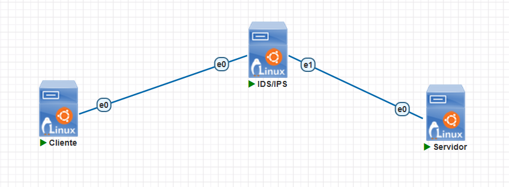

A rede consiste num **sensor IDS/IPS** entre duas redes, de forma que o tráfego passe por inspeção e gere alertas.

---

## Procedimentos

### Validação inicial do ambiente

Antes de instalar o Suricata, foi validado se o cenário já está funcional.

- Cliente

  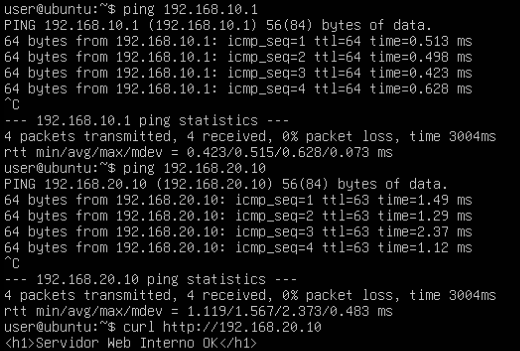

- Servidor

  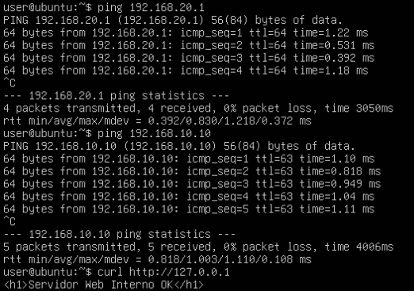

- IDS/IPS

  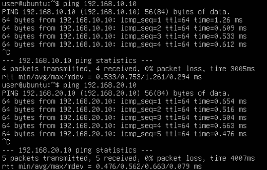

---

### Verificação do encaminhamento IP no sensor

No Linux IDS/IPS:

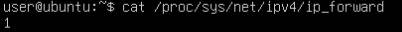

---

### Instalação do Suricata

No Linux IDS/IPS:

```bash
sudo apt update
sudo apt install -y suricata
```

Verificando versão:

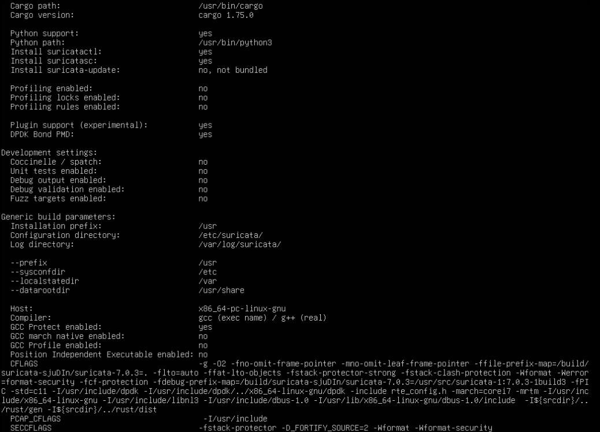

Verificando serviço:

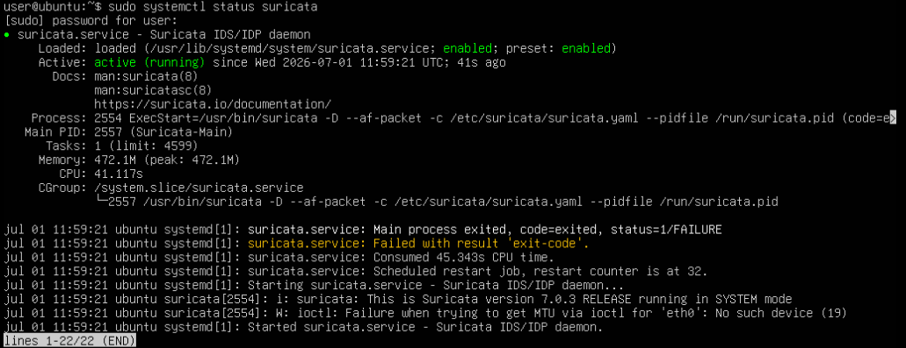

---

### Atualização das regras

Atualizou-se as regras do Suricata:

```bash
sudo suricata-update
```

Após a atualização, reiniciou-se o serviço:

```bash
sudo systemctl restart suricata
```

---

### Interfaces de captura

Antes de iniciar os testes, identificou-se os nomes corretos das interfaces:

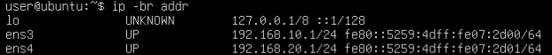

---

### Execução do Suricata em modo IDS e criação de regra local

O Suricata foi executado manualmente monitorando as duas interfaces, utilizando uma regra
local criada para garantir a geração de alertas visíveis.

Criação da regra local:

```bash
echo 'alert tcp any any -> any 80 (msg:"HTTP detectado"; sid:9000001; rev:1;)' | sudo tee /etc/suricata/rules/local.rules
```

Execução com a regra local:

```bash
sudo pkill suricata
sudo suricata -i ens3 -i ens4 -S /etc/suricata/rules/local.rules -v 2>/dev/null &
```

O parâmetro -S faz o Suricata ignorar as demais regras e utilizar exclusivamente o arquivo
especificado.

---

### Testes de tráfego

No cliente:

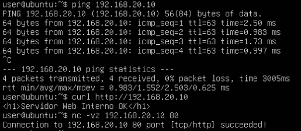

---

### Observação dos logs

- Alertas simples

  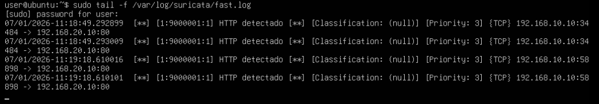

- Eventos estruturados

  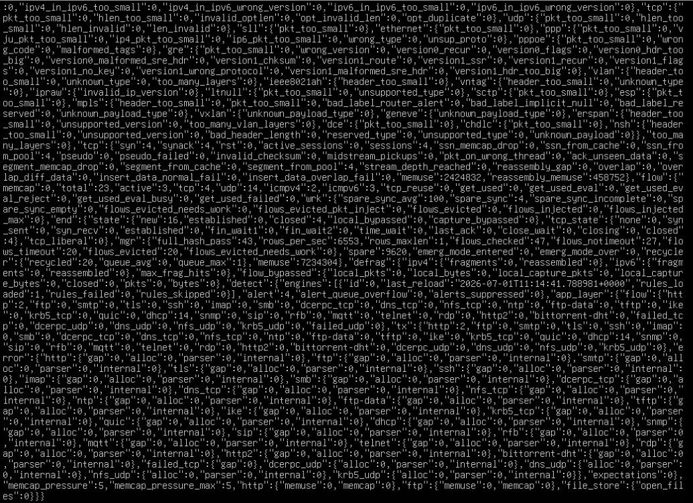

- Estatísticas

  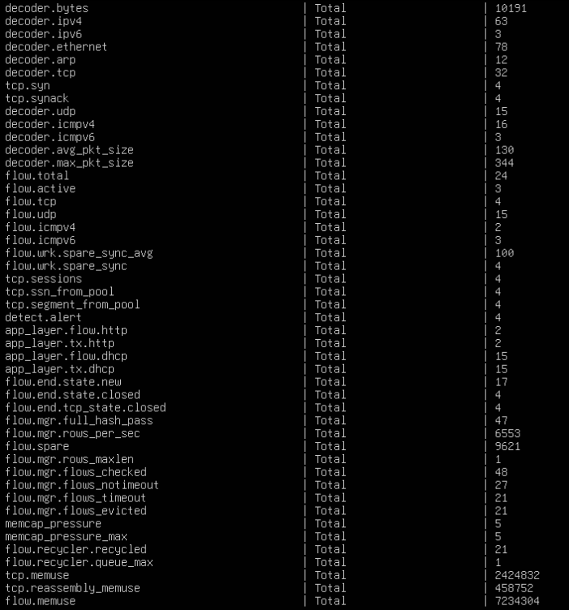

A partir desses logs é possível observar:

- src_ip : 192.168.10.10 (cliente)
- dest_ip : 192.168.20.10 (servidor)
- signature : mensagem da regra disparada
- proto : TCP (HTTP) ou ICMP
- action : allowed — confirmando que o IDS detecta sem bloquear

---

### Comparação com os laboratórios anteriores

| Recurso                                | Firewall de pacotes | Stateful | WAF          | IDS/IPS                    |
| -------------------------------------- | ------------------- | -------- | ------------ | -------------------------- |
| Filtrar por IP e porta                 | Sim                 | Sim      | Não é o foco | Pode observar              |
| Acompanhar estado de conexão           | Não                 | Sim      | Parcialmente | Pode analisar              |
| Inspecionar conteúdo HTTP              | Não                 | Não      | Sim          | Sim, dependendo das regras |
| Gerar alerta de comportamento suspeito | Limitado            | Limitado | Sim          | Sim                        |
| Bloquear automaticamente               | Sim                 | Sim      | Sim          | Somente em modo IPS        |

---

## Questões para análise

- **1. O que diferencia IDS de IPS?**

  A principal diferença entre um IDS (Intrusion Detection System) e um IPS (Intrusion Prevention System) está na forma de atuação diante de uma ameaça. O IDS monitora o tráfego da rede, identifica padrões suspeitos e gera alertas para que um administrador possa analisar os eventos, sem interferir na comunicação. Já o IPS, além de detectar atividades maliciosas, atua de forma preventiva, bloqueando ou descartando automaticamente os pacotes considerados ameaças antes que eles atinjam o destino.

- **2. Qual o papel do Suricata neste laboratório?**

  O Suricata foi utilizado como um sistema de detecção de intrusões (IDS), responsável por monitorar o tráfego que circulava entre o cliente e o servidor. Sua função foi inspecionar os pacotes de rede em tempo real, comparar esse tráfego com um conjunto de regras de detecção e registrar eventos e alertas nos arquivos de log sempre que fossem identificados padrões suspeitos ou previamente definidos.

- **3. Por que o IDS/IPS complementa o firewall e o WAF?**

  O firewall, o WAF e o IDS/IPS desempenham funções diferentes e complementares. O firewall controla o acesso à rede com base em endereços IP, protocolos e portas, enquanto o WAF protege aplicações web analisando requisições HTTP e bloqueando ataques voltados à camada de aplicação. O IDS/IPS acrescenta uma camada de monitoramento e análise do tráfego, sendo capaz de detectar comportamentos suspeitos e ataques que podem não ser bloqueados pelas demais tecnologias. Dessa forma, sua utilização aumenta a visibilidade sobre a segurança da rede e auxilia na identificação de incidentes.

- **4. O que os logs do `fast.log` mostram?**

  O arquivo `fast.log` apresenta os alertas gerados pelo Suricata em um formato simples e de fácil leitura. Cada registro normalmente contém informações como data e hora do evento, mensagem da assinatura acionada, protocolo utilizado, endereço IP de origem, endereço IP de destino e portas envolvidas. Esse arquivo é utilizado para uma consulta rápida dos eventos detectados.

- **5. O que o arquivo `eve.json` oferece de vantagem em relação ao `fast.log`?**

  O arquivo `eve.json` registra os eventos em formato JSON estruturado, contendo informações muito mais detalhadas do que o `fast.log`. Além dos dados básicos do alerta, ele pode incluir informações sobre fluxos de comunicação, protocolos, estatísticas, metadados e outros detalhes da sessão analisada. Por estar em formato JSON, facilita a integração com ferramentas de análise, monitoramento e SIEM, permitindo consultas e processamento automatizado dos eventos.

- **6. Todo tráfego suspeito gera alerta automaticamente? Explique.**

  Não. O Suricata somente gera alertas quando o tráfego corresponde a alguma regra de detecção carregada e habilitada. Caso determinado comportamento suspeito não possua uma assinatura correspondente ou a regra não esteja presente no conjunto de regras instalado, nenhum alerta será gerado. Portanto, a capacidade de detecção depende diretamente da qualidade, atualização e abrangência das regras utilizadas.

- **7. Qual a diferença entre detectar e bloquear?**

  Detectar significa identificar um comportamento suspeito, registrar o evento e informar sua ocorrência por meio de alertas, sem interromper a comunicação. Bloquear significa impedir que o tráfego considerado malicioso continue seu percurso, descartando ou rejeitando os pacotes antes que atinjam o destino. Em outras palavras, a detecção apenas informa a existência da ameaça, enquanto o bloqueio atua diretamente para impedir sua execução.

- **8. Por que uma varredura de portas pode ser relevante para um IDS?**

  Uma varredura de portas é frequentemente utilizada como etapa inicial por um invasor para descobrir quais serviços estão disponíveis em um determinado equipamento. Ao identificar portas abertas, torna-se possível direcionar ataques específicos aos serviços encontrados. Por esse motivo, um IDS considera esse comportamento potencialmente suspeito e pode gerar alertas, permitindo que os administradores identifiquem possíveis tentativas de reconhecimento da rede antes que ataques mais graves sejam realizados.

- **9. O IDS substitui firewall ou WAF? Explique.**

  Não. O IDS não substitui nem o firewall nem o WAF, pois cada tecnologia possui objetivos diferentes. O firewall controla o acesso à rede, o WAF protege aplicações web contra ataques direcionados ao protocolo HTTP e o IDS monitora o tráfego para detectar atividades suspeitas e gerar alertas. Em conjunto, essas soluções implementam uma estratégia de segurança em múltiplas camadas, oferecendo maior proteção do que qualquer uma delas isoladamente.

- **10. Qual foi a principal evidência prática da utilidade de um IDS no laboratório?**

  A principal evidência prática foi a capacidade do Suricata de monitorar o tráfego entre o cliente e o servidor e registrar eventos nos arquivos de log quando padrões definidos pelas regras de detecção eram identificados. Isso demonstrou que o IDS fornece visibilidade sobre o comportamento da rede, permitindo identificar atividades potencialmente maliciosas sem interferir no funcionamento normal da comunicação, reforçando sua importância como ferramenta de monitoramento e apoio à análise de incidentes.

---

## Conclusão

Este laboratório permitiu compreender o funcionamento de um Sistema de Detecção de Intrusões (IDS) por meio da implantação do Suricata em um ambiente simulado no PNetLab. Durante os testes, foi possível observar como o Suricata monitora o tráfego de rede, analisa os pacotes com base em regras de detecção e registra eventos em arquivos de log, fornecendo informações importantes para a identificação de atividades suspeitas.

Além disso, o experimento evidenciou que o IDS não substitui mecanismos como firewall e WAF, mas atua de forma complementar, acrescentando uma camada de monitoramento e visibilidade sobre o tráfego da rede. Enquanto o firewall controla o acesso e o WAF protege aplicações web, o IDS auxilia na detecção de possíveis ameaças e na investigação de incidentes de segurança.

Dessa forma, conclui-se que a utilização conjunta dessas tecnologias implementa uma estratégia de defesa em profundidade, aumentando a capacidade de proteção da infraestrutura e permitindo uma resposta mais eficiente a eventos de segurança. O laboratório também demonstrou a importância da correta configuração do ambiente, das regras de detecção e da análise dos logs para o funcionamento efetivo de um sistema IDS.
