Disciplina: **ENE0025 – Protocolos de Transporte e Roteamento**  
Curso: **Engenharia de Redes de Comunicação**  
Instituição: **Universidade de Brasília (UnB)**  
Departamento: **Engenharia Elétrica**

Professor Responsável: **Prof. Dr. Laerte Peotta de Melo**

# Relatório do Laboratório 13

## Identificação

- Nome: **Artur Kohara Guerra**
- Matrícula: **231025181**
- Turma: **01**

---

## Objetivo

Este laboratório tem como objetivo demonstrar o funcionamento do protocolo **DHCP (Dynamic Host Configuration Protocol)** em uma rede IPv4 privada classe C.

Ao final da atividade, deve ser possível:

- compreender a função do protocolo DHCP;
- configurar um servidor DHCP em ambiente Linux;
- configurar clientes para receberem endereços IP automaticamente;
- validar a atribuição dinâmica de endereços IPv4;
- analisar o processo DHCP por meio de comandos de rede;
- identificar os parâmetros entregues pelo servidor DHCP aos clientes.

---

## Topologia do Laboratório

A topologia é composta por:

- 1 servidor DHCP;
- 1 switch;
- 4 máquinas clientes.

Todos os dispositivos estarão na mesma rede local: `192.168.0.0/24`.

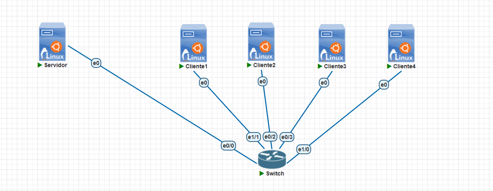

O servidor e os clientes são máquinas Linux Ubuntu 24.04 server.

---

## Procedimentos

### Configuração do Servidor DHCP

- **Configurando IP estático no servidor**

  Configurou-se o endereço IP do servidor:

  ```bash
  sudo ip addr flush dev ens3
  sudo ip addr add 192.168.0.1/24 dev ens3
  sudo ip link set ens3 up
  ```

  Verificou-se a configuração:

  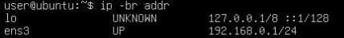

- **Instalando o serviço DHCP**

  ```bash
  sudo apt update
  sudo apt install -y isc-dhcp-server
  ```

- **Definindo a interface do serviço DHCP**

  Editou-se o arquivo:

  ```bash
  sudo nano /etc/default/isc-dhcp-server
  ```

  Localizou-se a linha:

  ```bash
  INTERFACESv4=""
  ```

  Alterou-se para:

  ```bash
  INTERFACESv4="eth0"
  ```

- **Configurando o escopo DHCP**

  Foi feito backup do arquivo original:

  ```bash
  sudo cp /etc/dhcp/dhcpd.conf /etc/dhcp/dhcpd.conf.bkp
  ```

  Editou-se o arquivo de configuração:

  ```bash
  sudo nano /etc/dhcp/dhcpd.conf
  ```

  Adicionou-se ao final do arquivo:

  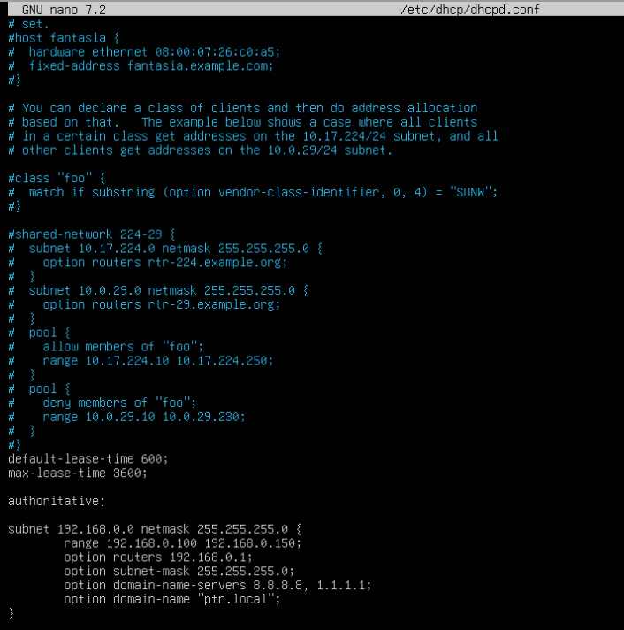

- **Validando a configuração**

  Antes de iniciar o serviço, validou-se a sintaxe:

  ```bash
  sudo dhcpd -t -cf /etc/dhcp/dhcpd.conf
  ```

  Reiniciou-se o serviço:

  ```bash
  sudo systemctl restart isc-dhcp-server
  ```

  Por fim, verificou-se o status:

  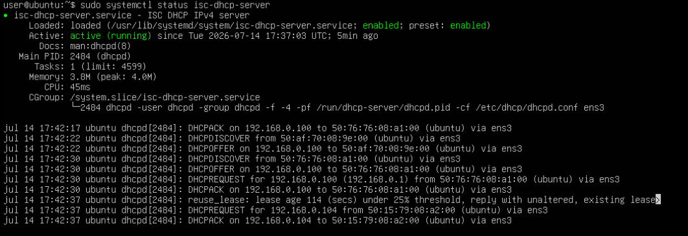

---

### Configuração dos Clientes DHCP

Em cada cliente, instalou-se o DHCP:

```bash
sudo apt update
sudo apt install isc-dhcp-client
```

Removeu-se as configurações antigas:

```bash
sudo ip addr flush dev ens3
sudo ip link set ens3 up
```

Solicitou-se um endereço IP ao servidor DHCP:

```bash
sudo dhclient -v ens3
```

---

### Verificação nos Clientes

- Cliente 1

  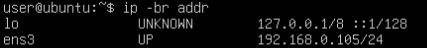

- Cliente 2

  

- Cliente 3

  

- Cliente 4

  

- Rota padrão dos clientes

  

- Servidor DNS dos clientes:

  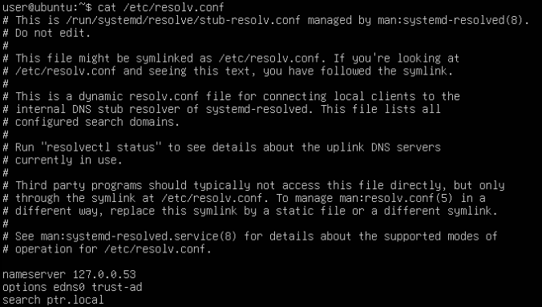

---

### Teste de Conectividade

- Cliente 1

  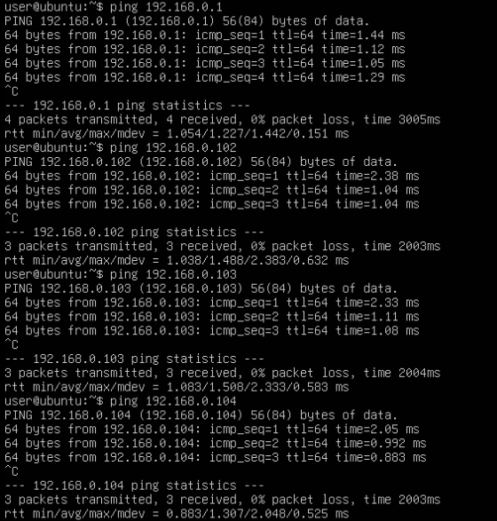

- Cliente 2

  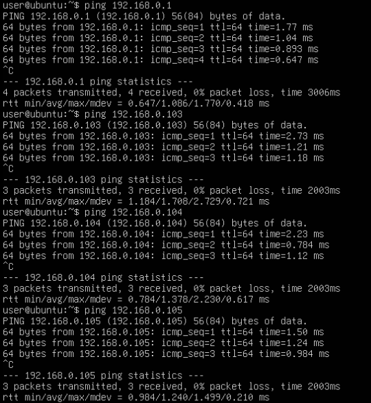

- Cliente 3

  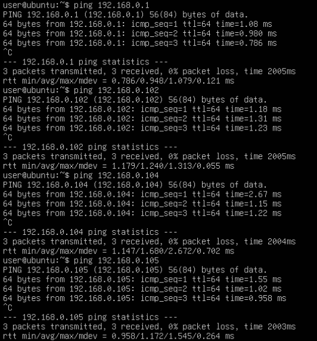

- Cliente 4

  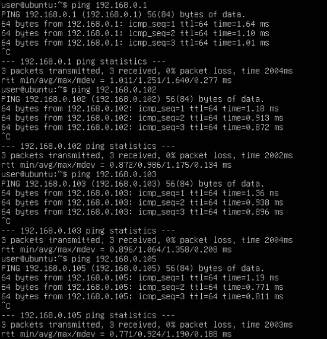

---

### Verificação das Concessões DHCP no Servidor

No servidor DHCP, visualizou-se as concessões:

```bash
sudo cat /var/lib/dhcp/dhcpd.leases
```

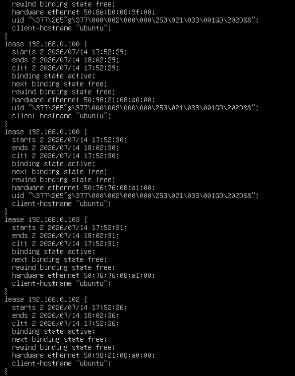

Também foi possível acompanhar os logs do serviço:

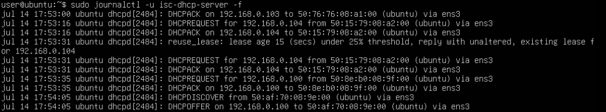

---

### Análise do Processo DHCP com tcpdump

No servidor DHCP, executou-se:

```bash
sudo tcpdump -i eth0 -n port 67 or port 68
```

Em um dos clientes, liberou-se o endereço atual e logo em seguida solicitoou-se novamente:

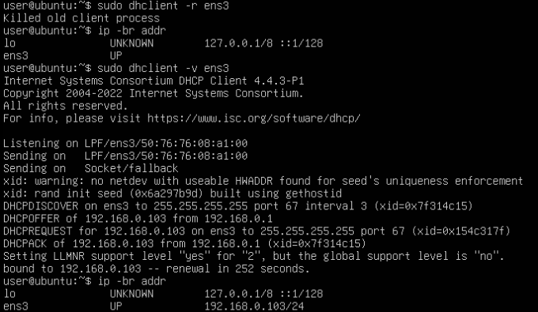

Nota-se que o cliente conseguiu obter o endereço de volta com sucesso.

No servidor, observou-se as seguintes mensagens:

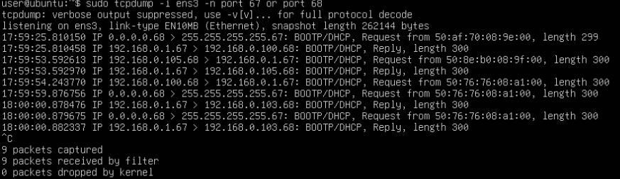

---

### Teste de Falha Controlada

Parou-se o serviço DHCP no servidor:

```bash
sudo systemctl stop isc-dhcp-server
```

Em um cliente, tentou-se obter endereço novamente:

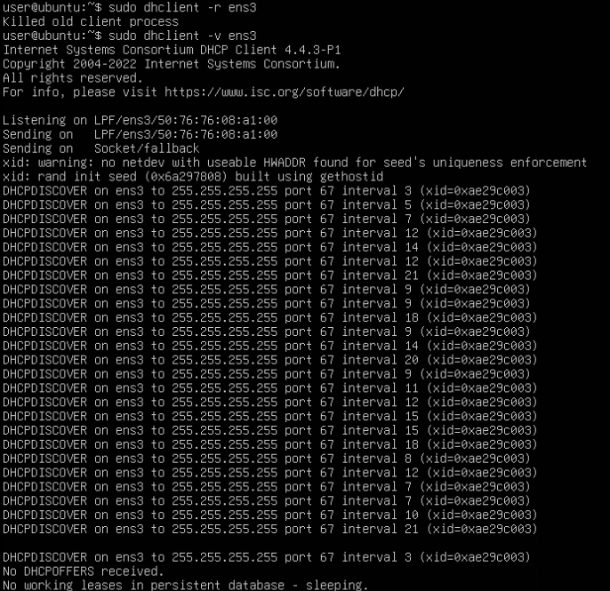

Percebe-se, portanto, que como o serviço DHCP foi interrompido, o cliente não conseguiu obter um endereço de volta.

---

## Questões para Fixação

- **1. Qual é a função principal do protocolo DHCP?**

  A principal função do protocolo DHCP (Dynamic Host Configuration Protocol) é atribuir automaticamente endereços IP e outros parâmetros de configuração de rede aos dispositivos clientes, eliminando a necessidade de configuração manual.

- **2. Por que o DHCP facilita a administração de redes?**

  O DHCP facilita a administração de redes porque automatiza a distribuição das configurações de rede, reduzindo erros de configuração, evitando conflitos de endereços IP e simplificando a inclusão de novos dispositivos na rede.

- **3. Quais informações o servidor DHCP pode entregar a um cliente?**

  O servidor DHCP pode fornecer diversas informações de configuração de rede, como: endereço IP; máscara de sub-rede; gateway padrão; servidores DNS; tempo de concessão (lease) do endereço IP; nome do domínio, quando configurado.

- **4. O que significa a sequência DORA?**

  A sequência DORA representa as quatro etapas do processo de obtenção de um endereço IP por meio do DHCP:
  - Discover: o cliente procura um servidor DHCP na rede;
  - Offer: o servidor oferece um endereço IP disponível;
  - Request: o cliente solicita o endereço oferecido;
  - ACK (Acknowledgment): o servidor confirma a concessão do endereço IP e envia os demais parâmetros de configuração.

- **5. Quais portas UDP são usadas pelo DHCP?**

  O protocolo DHCP utiliza o protocolo UDP para transporte, empregando porta UDP 67 para comunicação do servidor DHCP e porta UDP 68 para comunicação do cliente DHCP.

- **6. Qual é a diferença entre endereço IP estático e endereço IP dinâmico?**

  Um endereço IP estático é configurado manualmente e permanece o mesmo até que seja alterado pelo administrador. Já um endereço IP dinâmico é atribuído automaticamente por um servidor DHCP e pode mudar ao final do período de concessão ou quando o dispositivo se reconecta à rede.

- **7. O que é lease DHCP?**

  O lease DHCP é o período durante o qual um cliente tem permissão para utilizar um determinado endereço IP concedido pelo servidor. Antes do término desse período, o cliente pode solicitar a renovação da concessão para continuar utilizando o mesmo endereço.

- **8. O que acontece se o servidor DHCP estiver desligado?**

  Se o servidor DHCP estiver desligado, novos clientes ou clientes que precisem renovar sua concessão não conseguirão obter um endereço IP automaticamente. Como consequência, eles poderão ficar sem conectividade na rede ou utilizar um endereço IP automático de emergência, que normalmente não permite comunicação com outras redes.

- **9. Por que servidores normalmente usam IP fixo ou reserva DHCP?**

  Servidores normalmente utilizam endereços IP fixos ou reservas DHCP porque precisam ser acessados sempre pelo mesmo endereço IP. Isso garante estabilidade para serviços como DNS, servidores web, bancos de dados e compartilhamento de arquivos, evitando problemas causados por mudanças de endereço.

- **10. Como o `tcpdump` ajuda a visualizar o funcionamento do DHCP?**

  O `tcpdump` permite capturar e analisar os pacotes trafegados na rede em tempo real. Durante o funcionamento do DHCP, ele possibilita observar a troca das mensagens **DHCPDISCOVER**, **DHCPOFFER**, **DHCPREQUEST** e **DHCPACK**, permitindo verificar o processo DORA e auxiliar na identificação de possíveis problemas na comunicação entre clientes e servidor.

---

## Conclusão

Neste laboratório, foi configurado um servidor DHCP para distribuir automaticamente endereços IPv4 em uma rede privada classe C.

A rede utilizada foi `192.168.0.0/24`, com o servidor DHCP no endereço `192.168.0.1` e uma faixa dinâmica de `192.168.0.100` a `192.168.0.150`.

A prática permitiu observar que o DHCP reduz o esforço de configuração manual, evita erros operacionais e centraliza a administração dos parâmetros básicos de rede.

Além da configuração, a análise com `tcpdump`, logs do sistema e arquivo de concessões permitiu compreender o funcionamento real do protocolo DHCP em uma rede local.
