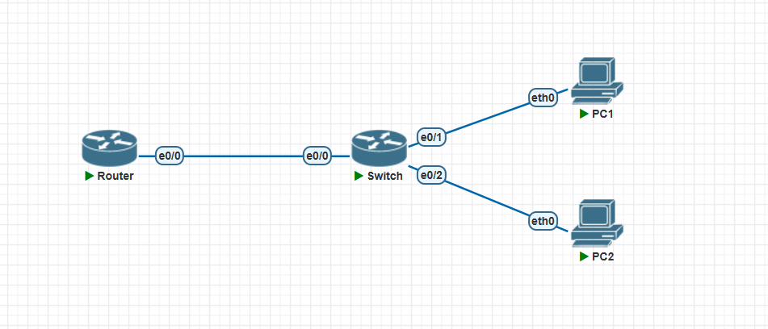
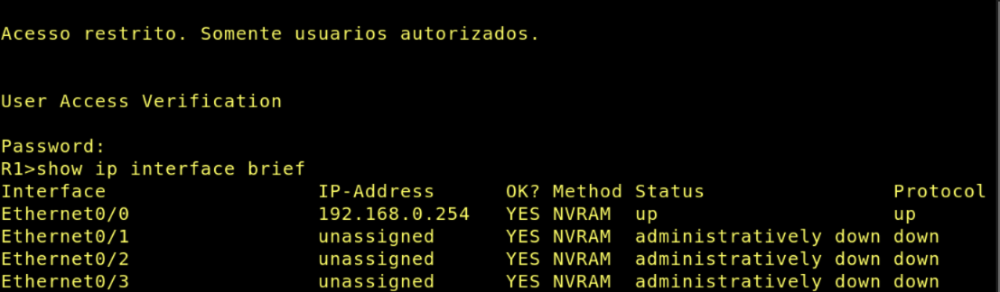

Disciplina: **ENE0025 – Protocolos de Transporte e Roteamento**  
Curso: **Engenharia de Redes de Comunicação**  
Instituição: **Universidade de Brasília (UnB)**  
Departamento: **Engenharia Elétrica**

Professor Responsável: **Prof. Dr. Laerte Peotta de Melo**

# Relatório do Laboratório 2

## Identificação

- Nome: **Artur Kohara Guerra**
- Matrícula: **231025181**
- Turma: **01**

## Objetivos

Os objetivos a serem alcançados neste laboratório são:

- montar uma topologia básica no PNetLab com roteador, switch e hosts;
- realizar o acesso inicial ao roteador por meio do console;
- compreender a função de cada elemento da topologia em uma rede local;
- configurar parâmetros básicos de administração no roteador;
- atribuir endereço IP à interface eth0/0 do roteador;
- configurar o endereçamento IP dos hosts da LAN;
- identificar o papel do gateway padrão na comunicação da rede;
- testar a conectividade entre roteador e estações com comandos de verificação;
- salvar a configuração realizada no equipamento;
- preparar o ambiente para os próximos laboratórios de roteamento.

## Ambiente experimental



- Roteador Cisco IOL L3
- Switch Cisco L2
- 2 hosts VPCS

## Procedimentos

### Configuração do roteador

#### Configuração inicial

```bash
enable
configure terminal
hostname R1
no ip domain-lookup
banner motd #
Acesso restrito. Somente usuarios autorizados.
#
enable secret unb123
service password-encryption
```

#### Configuração da linha de console

```bash
line console 0
password cisco
login
logging synchronous
exec-timeout 10 0
exit
```

#### Criação de usuário local e habilitação de SSH

```bash
username admin privilege 15 secret Admin@123
ip domain-name unb.lab
crypto key generate rsa
1024
ip ssh version 2
line vty 0 4
login local
transport input ssh
exec-timeout 10 0
logging synchronous
exit
```

#### Configuração da interface LAN

```bash
interface Ethernet0/0
description LAN-PNETLAB
ip address 192.168.0.254 255.255.255.0
no shutdown
exit
```

### Configuração dos Hosts VPCS

- PC 1
  ```bash
  ip 192.168.0.10/24 192.168.0.254
  save
  ```
- PC 2
  ```bash
  ip 192.168.0.20/24 192.168.0.254
  save
  ```

## Resultados e evidências

### Verificando as configurações do roteador

- 1

  ```bash
  show ip interface brief
  ```

  

## Análise técnica

(interpretação dos resultados)

## Conclusão
