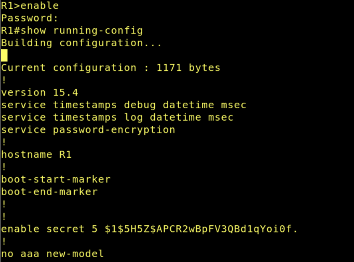
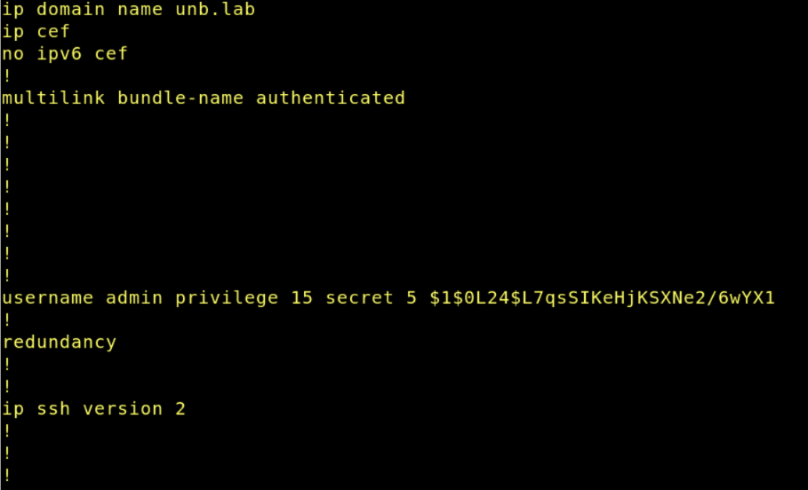
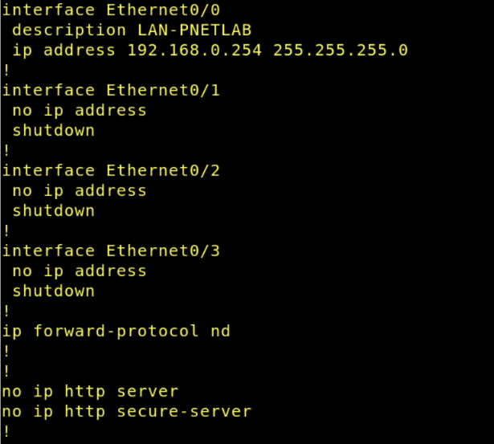
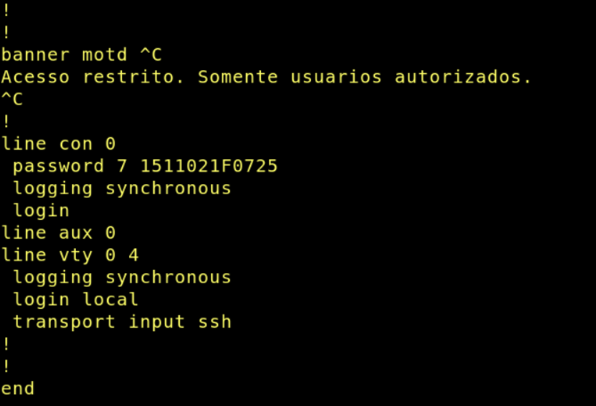
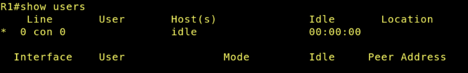
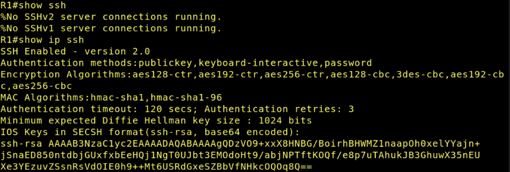
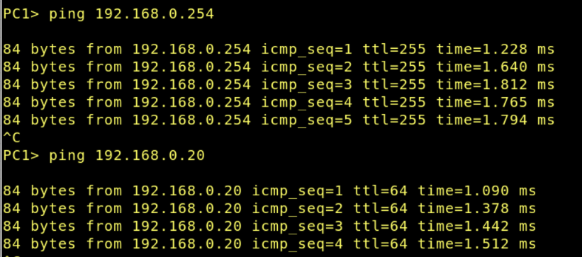
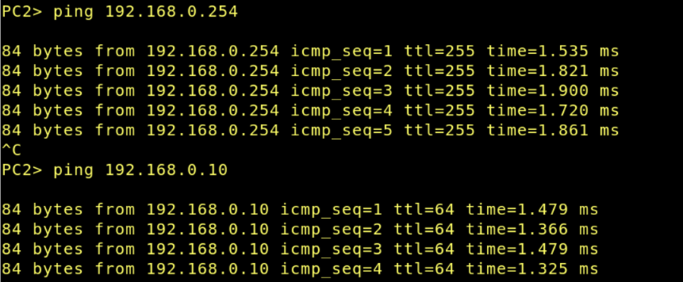

Disciplina: **ENE0025 – Protocolos de Transporte e Roteamento**  
Curso: **Engenharia de Redes de Comunicação**  
Instituição: **Universidade de Brasília (UnB)**  
Departamento: **Engenharia Elétrica**

Professor Responsável: **Prof. Dr. Laerte Peotta de Melo**

# Relatório do Laboratório 2

## Identificação

- Nome: **Artur Kohara Guerra**
- Matrícula: **231025181**
- Turma: **01**

## Objetivos

Os objetivos a serem alcançados neste laboratório são:

- montar uma topologia básica no PNetLab com roteador, switch e hosts;
- realizar o acesso inicial ao roteador por meio do console;
- compreender a função de cada elemento da topologia em uma rede local;
- configurar parâmetros básicos de administração no roteador;
- atribuir endereço IP à interface eth0/0 do roteador;
- configurar o endereçamento IP dos hosts da LAN;
- identificar o papel do gateway padrão na comunicação da rede;
- testar a conectividade entre roteador e estações com comandos de verificação;
- salvar a configuração realizada no equipamento;
- preparar o ambiente para os próximos laboratórios de roteamento.

## Ambiente experimental


- Roteador Cisco IOL L3
- Switch Cisco L2
- 2 hosts VPCS

## Procedimentos

### Configuração do roteador

#### Configuração inicial

```bash
enable
configure terminal
hostname R1
no ip domain-lookup
banner motd #
Acesso restrito. Somente usuarios autorizados.
#
enable secret unb123
service password-encryption
```

#### Configuração da linha de console

```bash
line console 0
password cisco
login
logging synchronous
exec-timeout 10 0
exit
```

#### Criação de usuário local e habilitação de SSH

```bash
username admin privilege 15 secret Admin@123
ip domain-name unb.lab
crypto key generate rsa
1024
ip ssh version 2
line vty 0 4
login local
transport input ssh
exec-timeout 10 0
logging synchronous
exit
```

#### Configuração da interface LAN

```bash
interface Ethernet0/0
description LAN-PNETLAB
ip address 192.168.0.254 255.255.255.0
no shutdown
exit
```

### Configuração dos Hosts VPCS

Nesta parte foi configurado o ip e o gateway de cada host.

- PC 1
  ```bash
  ip 192.168.0.10/24 192.168.0.254
  save
  ```
- PC 2
  ```bash
  ip 192.168.0.20/24 192.168.0.254
  save
  ```

## Resultados e evidências

### Verificando as configurações do roteador

- Verificando interface de ip:

  ```bash
  show ip interface brief
  ```

  
  Nessa imagem é possível ver que o ip do roteador foi devidamente configurado e está ativo para comunicação.

- Verificando as principais configurações:

  ```bash
  enable
  show ip running-config
  ```

  

  

  

  

  Nas imagens acima, é possível verificar as configurações de hostname, senha criptografada para acesso ao roteador, configurações de domínio, usuário admin, SSH, interface LAN, configurações de console e vty, respectivamente, que foram feitas no início do laboratório.

- Verificando os usuários:

  ```bash
  show users
  ```

  

  Aqui é possível verificar que o único usuário conectado é o próprio console (terminal).

- Verificando configurações de ssh:

  ```bash
  show ssh
  show ip ssh
  ```

  

  Como foram utilizados hosts VPCS, eles não possuem suporte ao protocolo SSH, logo, o comando `show ssh` não retorna nenhuma conexão SSH. No entanto, ao rodar o comando `show ip ssh`, pode ser visto que o SSH foi devidamente configurado e está pronto para aceitar conexões caso um cliente compatível esteja disponível.

### Testes de comunicação nos hosts

- No PC1:

  

  Testa comunicação com o gateway (roteador) e com PC2.

- No PC2:

  

  Testa comunicação com o gateway (roteador) e com PC1.

## Análise técnica

- **Qual a diferença entre acesso via console e acesso remoto pela rede?**

  O acesso via console é um método de gerenciamento local do roteador, realizado por meio de uma conexão direta, geralmente utilizando um cabo de console. Esse tipo de acesso independe da configuração de rede do dispositivo, sendo possível mesmo quando não há endereço IP configurado.

  Já o acesso remoto pela rede é realizado por meio de protocolos como SSH ou Telnet, utilizando a infraestrutura de rede. Nesse caso, é necessário que o roteador possua um endereço IP configurado e acessível, além de configurações adicionais, como criação de usuários e habilitação das linhas VTY.

- **Qual a função do comando `no ip domain-lookup` em laboratório?**

  O comando `no ip domain-lookup` é utilizado para desabilitar a tentativa automática de resolução de nomes de domínio pelo roteador.

  Por padrão, quando um comando inválido é digitado na CLI do roteador, o sistema interpreta essa entrada como um possível nome de host e tenta resolvê-lo via DNS. Esse processo pode causar atrasos significativos na resposta do terminal, especialmente em ambientes onde não há servidor DNS configurado, como em laboratórios.

  Ou seja, esse comando torna a interação com a CLI mais rápida, evitando travamentos causados por consultas DNS desnecessárias.

- **Por que o comando `enable secret` é preferível ao `enable password`?**

  O comando `enable secret` é preferível ao `enable password`, pois ele oferece um nível significativamente maior de segurança no armazenamento da senha de acesso privilegiado do roteador.

  O `enable password` armazena a senha em texto plano ou utilizando métodos de criptografia fracos, o que permite que ela seja facilmente visualizada ao acessar a configuração do dispositivo.

  O `enable secret`, em contrapartida, utiliza um algoritmo de hash criptográfico para proteger a senha, o que impede sua leitura direta mesmo que a configuração do roteador seja acessada.

- **Por que o protocolo SSH é mais seguro que o Telnet?**

  O protocolo SSH é mais seguro que o Telnet, pois utiliza mecanismos de criptografia para proteger a comunicação entre o cliente e o servidor, garantindo confidencialidade, integridade e autenticação, enquanto o Telnet transmite todas as informações em texto plano, facilitando a interceptação e captura de pacotes por invasores.

- **O que ocorre se a interface não receber o comando `no shutdown`?**

  Se a interface não receber o comando `no shutdown`, ela permanecerá em estado administrativamente desativado (administratively down), impedindo qualquer tipo de comunicação através dessa interface.

  Por padrão, em dispositivos Cisco, as interfaces vêm desabilitadas. Logo, o comando `no shutdown` é necessário para ativar uma interface e permitir o envio e recebimento de pacotes.

## Conclusão

Dominar CLI, interface IP, acesso remoto e testes de conectividade é essencial antes da evolução para protocolos de roteamento e atividades de diagnóstico mais avançadas. Logo, neste laboratório foi possível introduzir a configuração básica de roteadores no PNetLab e estabelecer as competências mínimas necessárias para os próximos cenários da disciplina com sucesso.
