Disciplina: **ENE0025 – Protocolos de Transporte e Roteamento**  
Curso: **Engenharia de Redes de Comunicação**  
Instituição: **Universidade de Brasília (UnB)**  
Departamento: **Engenharia Elétrica**

Professor Responsável: **Prof. Dr. Laerte Peotta de Melo**

# Relatório do Laboratório 5

## Identificação

- Nome: **Artur Kohara Guerra**
- Matrícula: **231025181**
- Turma: **01**

## Objetivo

O objetivo deste experimento é configurar e validar o roteamento dinâmico em uma topologia composta por três roteadores, utilizando os protocolos **RIP** e **OSPF**, de forma a comparar seus comportamentos, características e desempenho em um mesmo cenário de rede.


## Topologia do Laboratório

A topologia implementada no ambiente PNetLab consiste em:

- 3 roteadores interligando três unidades:
  - Router-RJ - Rio de Janeiro
  - Router-SP - São Paulo
  - Router-BH - Belo Horizonte
- 6 switches (2 por unidade)
- 12 hosts (4 por unidade)
- 2 enlaces WAN:
  - RJ ↔ SP
  - SP ↔ BH

Cada roteador conecta duas redes locais (LANs) e realiza o encaminhamento de pacotes entre as diferentes unidades.

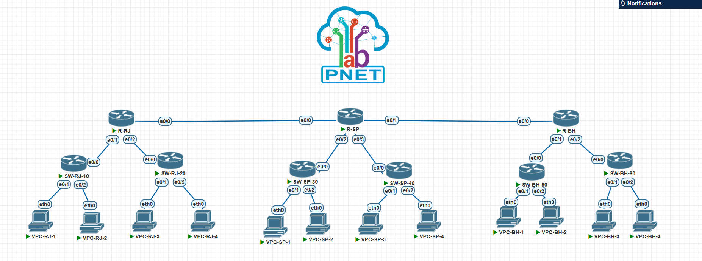

### Redes utilizadas

| Segmento | Rede | Máscara |
|---|---|---|
| LAN RJ-10 | 172.16.10.0 | 255.255.255.0 |
| LAN RJ-20 | 172.16.20.0 | 255.255.255.0 |
| WAN RJ-SP | 172.16.100.0 | 255.255.255.0 |
| LAN SP-30 | 172.16.30.0 | 255.255.255.0 |
| LAN SP-40 | 172.16.40.0 | 255.255.255.0 |
| WAN SP-BH | 172.16.200.0 | 255.255.255.0 |
| LAN BH-50 | 172.16.50.0 | 255.255.255.0 |
| LAN BH-60 | 172.16.60.0 | 255.255.255.0 |

### Endereçamento das interfaces dos roteadores

#### Router-RJ

| Interface | Endereço IP | Máscara | Função |
|---|---|---|---|
| `e0/0` | 172.16.100.1 | 255.255.255.0 | WAN para São Paulo |
| `e0/1` | 172.16.10.254 | 255.255.255.0 | LAN RJ-10 |
| `e0/2` | 172.16.20.254 | 255.255.255.0 | LAN RJ-20 |

#### Router-SP

| Interface | Endereço IP | Máscara | Função |
|---|---|---|---|
| `e0/0` | 172.16.100.2 | 255.255.255.0 | WAN para Rio de Janeiro |
| `e0/1` | 172.16.200.1 | 255.255.255.0 | WAN para Belo Horizonte |
| `e0/2` | 172.16.30.254 | 255.255.255.0 | LAN SP-30 |
| `e0/3` | 172.16.40.254 | 255.255.255.0 | LAN SP-40 |

#### Router-BH

| Interface | Endereço IP | Máscara | Função |
|---|---|---|---|
| `e0/0` | 172.16.200.2 | 255.255.255.0 | WAN para São Paulo |
| `e0/1` | 172.16.50.254 | 255.255.255.0 | LAN BH-50 |
| `e0/2` | 172.16.60.254 | 255.255.255.0 | LAN BH-60 |

### Endereçamento dos hosts

| Host | Endereço IP | Máscara | Gateway |
|---|---|---|---|
| VPC-RJ-1 | 172.16.10.1 | 255.255.255.0 | 172.16.10.254 |
| VPC-RJ-2 | 172.16.10.2 | 255.255.255.0 | 172.16.10.254 |
| VPC-RJ-3 | 172.16.20.1 | 255.255.255.0 | 172.16.20.254 |
| VPC-RJ-4 | 172.16.20.2 | 255.255.255.0 | 172.16.20.254 |
| VPC-SP-1 | 172.16.30.1 | 255.255.255.0 | 172.16.30.254 |
| VPC-SP-2 | 172.16.30.2 | 255.255.255.0 | 172.16.30.254 |
| VPC-SP-3| 172.16.40.1 | 255.255.255.0 | 172.16.40.254 |
| VPC-SP-4 | 172.16.40.2 | 255.255.255.0 | 172.16.40.254 |
| VPC-BH-1 | 172.16.50.1 | 255.255.255.0 | 172.16.50.254 |
| VPC-BH-2 | 172.16.50.2 | 255.255.255.0 | 172.16.50.254 |
| VPC-BH-3 | 172.16.60.1 | 255.255.255.0 | 172.16.60.254 |
| VPC-BH-4 | 172.16.60.2 | 255.255.255.0 | 172.16.60.254 |

## Procedimento

O procedimento do laboratório consistiu em:
- Configurar as interfaces de todos os hosts e roteadores
- Configurar o RIP em todos os roteadores e verificar a comunicação
- Remover o RIP de todos os roteadores
- Configurar o OSPF em todos os roteadores e verificar a comunicação

### Configuração básica das interfaces

#### VPCs

Todos os VPCs desse laboratório foram configurados de acordo com a tabela de endereçamento apresentada na parte **Endereçamento dos hosts** seguindo o seguinte formato:

```bash
Formato básico: ip <ip_address> <subnet_mask> <gateway>

ip 172.16.60.2 255.255.255.0 172.16.60.254
show ip
save

```

#### Router-RJ

```bash
Router> enable
Router# configure terminal
Router(config)# hostname Router-RJ
Router-RJ(config)# interface e0/0
Router-RJ(config-if)# ip address 172.16.100.1 255.255.255.0
Router-RJ(config-if)# no shutdown
Router-RJ(config-if)# interface e0/1
Router-RJ(config-if)# ip address 172.16.10.254 255.255.255.0
Router-RJ(config-if)# no shutdown
Router-RJ(config-if)# interface e0/2
Router-RJ(config-if)# ip address 172.16.20.254 255.255.255.0
Router-RJ(config-if)# no shutdown
Router-RJ(config-if)# end

```

#### Router-SP

```bash
Router> enable
Router# configure terminal
Router(config)# hostname Router-SP
Router-SP(config)# interface e0/0
Router-SP(config-if)# ip address 172.16.100.2 255.255.255.0
Router-SP(config-if)# no shutdown
Router-SP(config-if)# interface e0/1
Router-SP(config-if)# ip address 172.16.200.1 255.255.255.0
Router-SP(config-if)# no shutdown
Router-SP(config-if)# interface e0/2
Router-SP(config-if)# ip address 172.16.30.254 255.255.255.0
Router-SP(config-if)# no shutdown
Router-SP(config-if)# interface e0/3
Router-SP(config-if)# ip address 172.16.40.254 255.255.255.0
Router-SP(config-if)# no shutdown
Router-SP(config-if)# end

```

#### Router-BH

```bash
Router> enable
Router# configure terminal
Router(config)# hostname Router-BH
Router-BH(config)# interface e0/0
Router-BH(config-if)# ip address 172.16.200.2 255.255.255.0
Router-BH(config-if)# no shutdown
Router-BH(config-if)# interface e0/1
Router-BH(config-if)# ip address 172.16.50.254 255.255.255.0
Router-BH(config-if)# no shutdown
Router-BH(config-if)# interface e0/2
Router-BH(config-if)# ip address 172.16.60.254 255.255.255.0
Router-BH(config-if)# no shutdown
Router-BH(config-if)# end

```

### Configuração do RIP

#### Router-RJ

```bash
Router-RJ> enable
Router-RJ# configure terminal
Router-RJ(config)# router rip
Router-RJ(config-router)# network 172.16.0.0
Router-RJ(config-router)# end
Router-RJ#

```

#### Router-SP

```bash
Router-SP> enable
Router-SP# configure terminal
Router-SP(config)# router rip
Router-SP(config-router)# network 172.16.0.0
Router-SP(config-router)# end
Router-SP#
```

#### Router-BH

```bash
Router-BH> enable
Router-BH# configure terminal
Router-BH(config)# router rip
Router-BH(config-router)# network 172.16.0.0
Router-BH(config-router)# end
Router-BH#
```

### Verificação do RIP

#### `show ip route`

- Router-RJ
  
  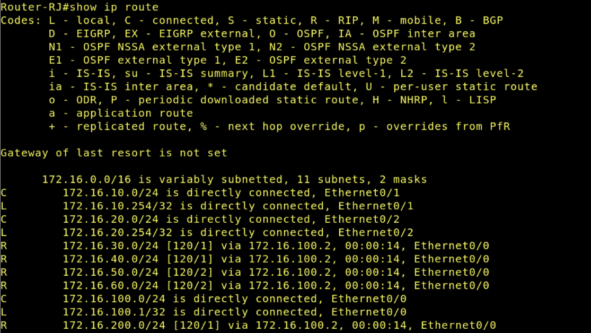

- Router-SP
  
  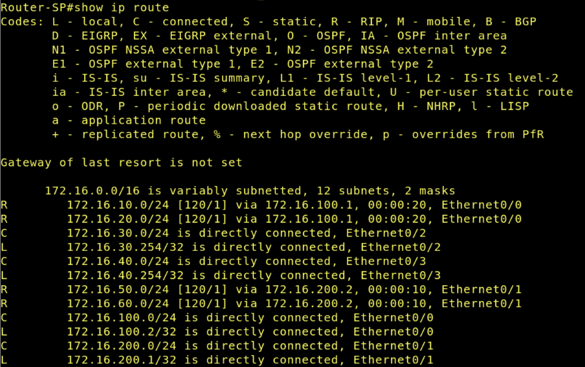

- Router-BH
  
  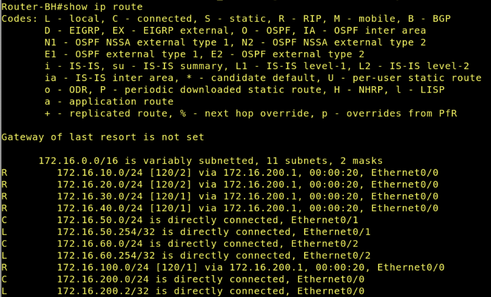

#### Teste de conexão

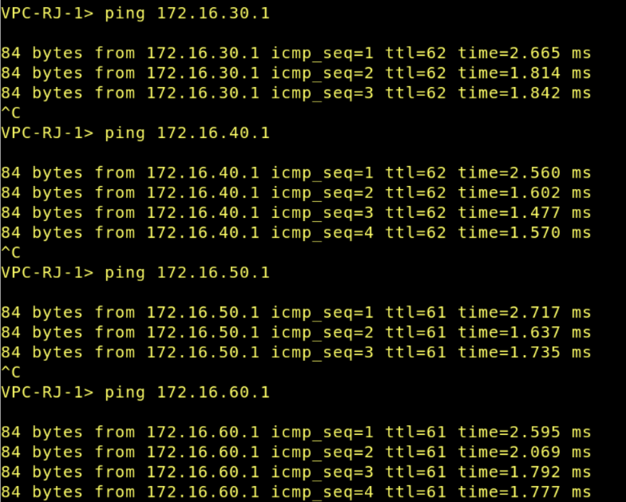

### Remoção do RIP

Em cada roteador:

```bash
configure terminal
no router rip
end
write memory
```

### Configuração do OSPF

Neste laboratório será utilizada apenas a **área 0**, com objetivo introdutório.

#### Router-RJ

```bash
Router-RJ> enable
Router-RJ# configure terminal
Router-RJ(config)# router ospf 64
Router-RJ(config-router)# network 172.16.10.0 0.0.0.255 area 0
Router-RJ(config-router)# network 172.16.20.0 0.0.0.255 area 0
Router-RJ(config-router)# network 172.16.100.0 0.0.0.255 area 0
Router-RJ(config-router)# end
```

#### Router-SP

```bash
Router-SP> enable
Router-SP# configure terminal
Router-SP(config)# router ospf 65
Router-SP(config-router)# network 172.16.30.0 0.0.0.255 area 0
Router-SP(config-router)# network 172.16.40.0 0.0.0.255 area 0
Router-SP(config-router)# network 172.16.100.0 0.0.0.255 area 0
Router-SP(config-router)# network 172.16.200.0 0.0.0.255 area 0
Router-SP(config-router)# end
```

#### Router-BH

```bash
Router-BH> enable
Router-BH# configure terminal
Router-BH(config)# router ospf 66
Router-BH(config-router)# network 172.16.50.0 0.0.0.255 area 0
Router-BH(config-router)# network 172.16.60.0 0.0.0.255 area 0
Router-BH(config-router)# network 172.16.200.0 0.0.0.255 area 0
Router-BH(config-router)# end

```

### Verificação do OSPF

#### `show ip ospf neighbor`

- Router-RJ
  
  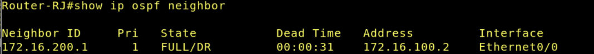

- Router-SP
  
  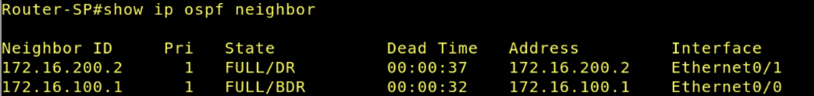

- Router-BH
  
  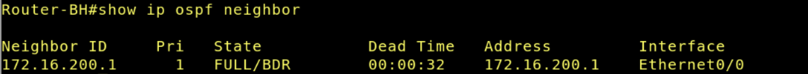

#### `show ip route`

- Router-RJ
  
  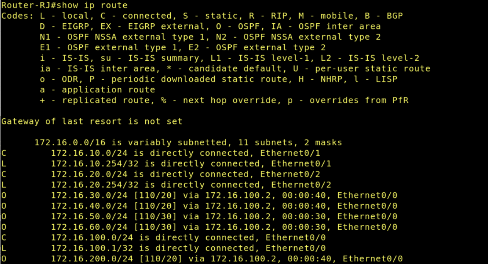

- Router-SP
  
  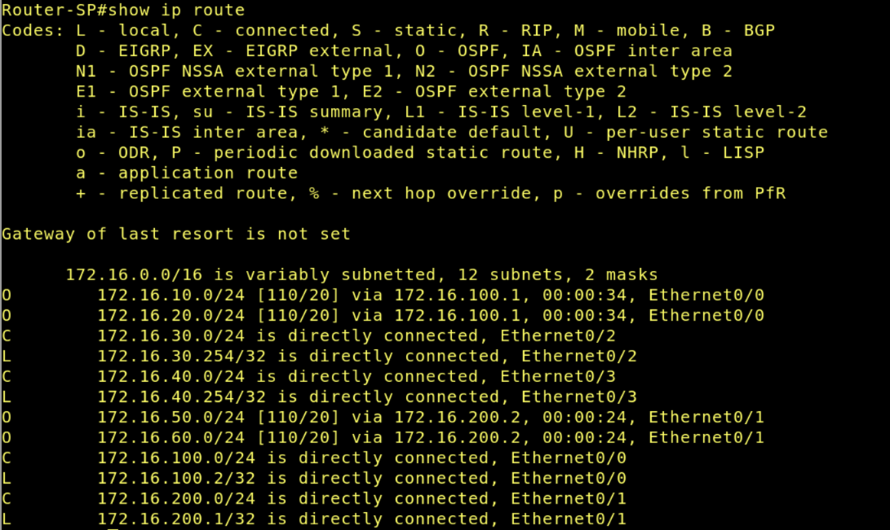

- Router-BH
  
  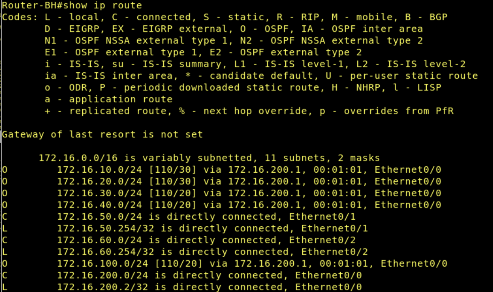

#### Teste de conexão

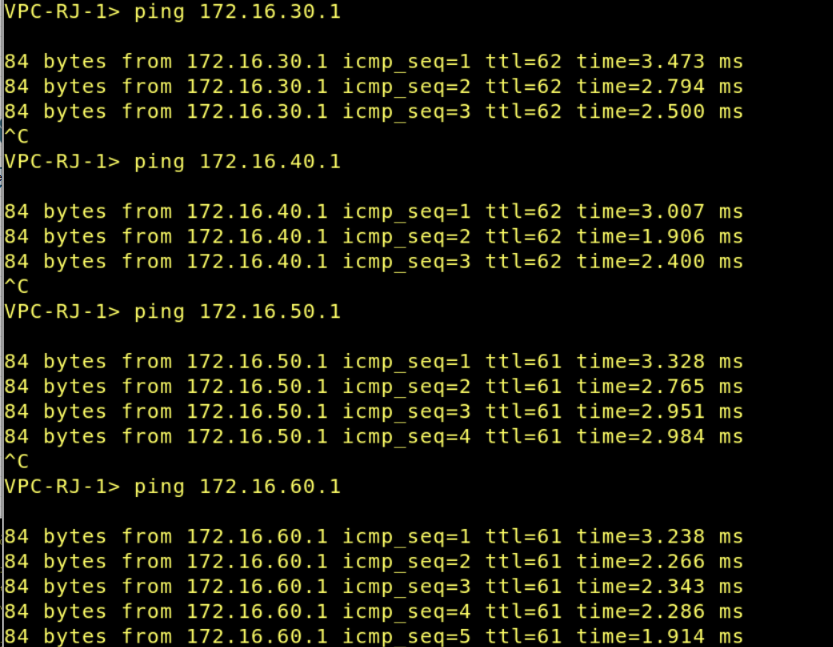

## Comparação entre RIP e OSPF

- **Qual protocolo foi mais simples de configurar?**
  
  O protocolo RIP foi mais simples de configurar, pois sua configuração exige poucos comandos e utiliza apenas o anúncio da rede principal através do comando `network`.

- **Qual protocolo apresentou maior riqueza de informações operacionais?**
  
  O OSPF apresentou maior riqueza de informações operacionais, pois fornece detalhes sobre vizinhança, adjacência e estados da rede, por meio do comando `show ip ospf neighbor`.

- **Qual a principal métrica do RIP?**
  
  A principal métrica do RIP é a contagem de saltos (hop count). O protocolo considera melhor a rota que possui menor número de roteadores intermediários até o destino.

- **Qual algoritmo é usado pelo OSPF?**
  
  O OSPF utiliza o algoritmo SPF (Shortest Path First), também conhecido como algoritmo de Dijkstra, para calcular o melhor caminho entre as redes.

- **Qual protocolo tende a escalar melhor?**
  
  O OSPF tende a escalar melhor.

- **Qual protocolo converge melhor em cenários maiores?**
  
  O OSPF apresenta melhor convergência em cenários maiores, pois atualiza rapidamente as informações de rota quando ocorre alguma mudança na rede, reduzindo o tempo de indisponibilidade e tornando a comunicação mais estável.