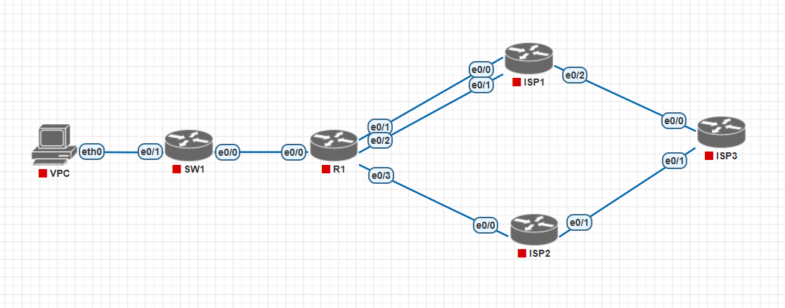
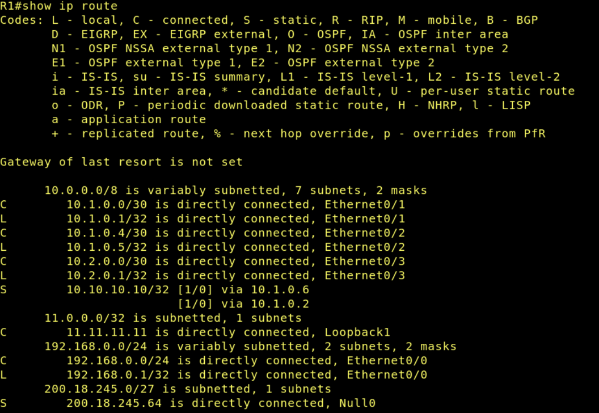
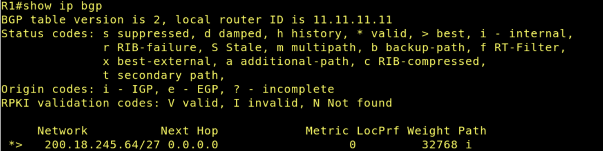
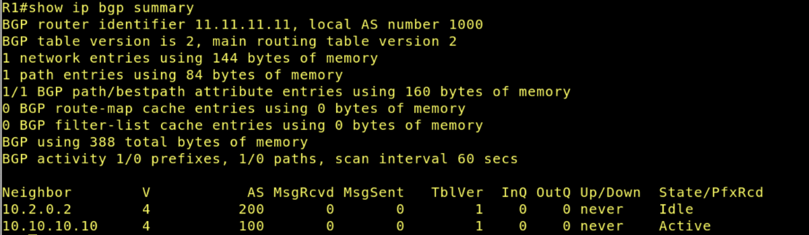

Disciplina: **ENE0025 – Protocolos de Transporte e Roteamento**  
Curso: **Engenharia de Redes de Comunicação**  
Instituição: **Universidade de Brasília (UnB)**  
Departamento: **Engenharia Elétrica**

Professor Responsável: **Prof. Dr. Laerte Peotta de Melo**

# Relatório do Laboratório 6

## Identificação

- Nome: **Artur Kohara Guerra**
- Matrícula: **231025181**
- Turma: **01**

---

## Objetivos

Este laboratório visa simular a configuração do protocolo BGP no roteador de uma empresa para que ela possa anunciar seu prefixo público à Internet por meio de seus provedores. Dessa forma, os objetivos do experimeto são:

- compreender o papel do **BGP** no roteamento entre sistemas autônomos;
- identificar vizinhanças **eBGP**;
- configurar o BGP em um roteador de borda corporativo;
- anunciar um prefixo público usando o comando `network`;
- entender o uso de **loopback**, `update-source` e `ebgp-multihop`;
- verificar a tabela de rotas e a tabela BGP.

---

## Topologia do Laboratório



O cenário representa um pequeno trecho do núcleo operacional da Internet, com **três provedores** e **uma empresa** que precisa anunciar o bloco público **`200.18.245.64/27`**, de maneira que:

- a empresa pertence ao **AS 1000**;
- o **ISP1** pertence ao **AS 100**;
- o **ISP2** pertence ao **AS 200**;
- o **ISP3** pertence ao **AS 300**;
- a senha das vizinhanças é **`SENHA`**.

---

### Descrição do cenário

A **empresa** pertence ao **AS 1000** e possui o bloco público **200.18.245.64/27**, que será anunciado para a Internet usando o protocolo **BGP**. Internamente, a empresa também possui a rede local **192.168.0.0/24**, conectada ao roteador **R1** por meio do **SW1**. No roteador da empresa, também é criada a interface de loopback **11.11.11.11/32**, que será usada como origem da sessão BGP com o **ISP1**.

O roteador **R1** conecta-se ao **ISP1**, pertencente ao **AS 100**, por dois enlaces físicos, usando as redes **10.1.0.0/30** e **10.1.0.4/30**. Entretanto, a vizinhança BGP com o ISP1 não é feita pelos endereços físicos desses enlaces. Ela é estabelecida com o endereço **10.10.10.10/32**, que corresponde à **interface de loopback do ISP1**. Por isso, no roteador da empresa é necessário usar os comandos `update-source Loopback1` e `ebgp-multihop 2`, além de criar rotas estáticas para alcançar esse endereço pelos enlaces disponíveis.

A empresa também se conecta ao **ISP2**, pertencente ao **AS 200**, por meio da rede **10.2.0.0/30**. Nesse caso, a vizinhança BGP é feita diretamente com o endereço real da interface do provedor, **10.2.0.2**, sem necessidade de loopback remota.

O **ISP1** conecta-se ao **ISP3**, pertencente ao **AS 300**, pela rede **191.1.0.0/30**. O **ISP2** também se conecta ao **ISP3**, usando a rede **191.2.0.0/30**. No **AS 300**, o roteador **ISP3** concentra vários prefixos externos já existentes no cenário, entre eles **181.0.0.0/8**, **182.0.0.0/8**, **183.0.0.0/8**, **184.0.0.0/8** e **185.0.0.0/8**.

Dessa forma, o laboratório representa uma empresa anunciando seu prefixo público para dois provedores distintos, sendo um deles configurado com vizinhança via loopback e outro com vizinhança direta pela interface física.

---

## Procedimentos

### Configuração básica das interfaces em R1

```bash
R1> enable

R1# configure terminal

R1(config)# no ip domain lookup

R1(config)# interface loopback 1

R1(config-if)# ip address 11.11.11.11 255.255.255.255

R1(config-if)# no shutdown

R1(config-if)# interface e0/0

R1(config-if)# ip address 192.168.0.1 255.255.255.0

R1(config-if)# no shutdown

R1(config-if)# interface e0/1

R1(config-if)# ip address 10.1.0.1 255.255.255.252

R1(config-if)# no shutdown

R1(config-if)# interface e0/2

R1(config-if)# ip address 10.1.0.5 255.255.255.252

R1(config-if)# no shutdown

R1(config-if)# interface e0/3

R1(config-if)# ip address 10.2.0.1 255.255.255.252

R1(config-if)# no shutdown

R1(config-if)# end
```

---

### Configuração do BGP em R1

```bash
R1> enable

R1# configure terminal

R1(config)# router bgp 1000

R1(config-router)# neighbor 10.10.10.10 remote-as 100

R1(config-router)# neighbor 10.10.10.10 password SENHA

R1(config-router)# neighbor 10.10.10.10 ebgp-multihop 2

R1(config-router)# neighbor 10.10.10.10 update-source Loopback1

R1(config-router)# neighbor 10.2.0.2 remote-as 200

R1(config-router)# neighbor 10.2.0.2 password SENHA

R1(config-router)# network 200.18.245.64 mask 255.255.255.224

R1(config-router)# exit

R1(config)# ip route 10.10.10.10 255.255.255.255 10.1.0.2

R1(config)# ip route 10.10.10.10 255.255.255.255 10.1.0.6

R1(config)# ip route 200.18.245.64 255.255.255.224 Null0
```

---

### Verificação

- ```bash
    Router# show ip route
  ```

  

- ```bash
    Router# show ip bgp
  ```

  

- ```bash
    Router# show ip bgp summary
  ```
  

---

## Questões para análise

- **1. Qual é a função do BGP nesse cenário?**

  O protocolo BGP tem a função de realizar o roteamento entre diferentes ASs, permitindo que a empresa do AS 1000 anuncie seu prefixo público `200.18.245.64/27` para os provedores ISP1 e ISP2. Dessa forma, outras redes da Internet conseguem aprender o caminho até a rede da empresa. O BGP também permite a troca de informações de roteamento entre os provedores, possibilitando que as rotas sejam propagadas entre os diferentes ASs do cenário.

- **2. Por que a sessão com o ISP1 usa endereço de loopback?**

  A sessão com o ISP1 utiliza endereços de loopback para aumentar a estabilidade da conexão BGP. Interfaces de loopback são interfaces lógicas que permanecem ativas independentemente do estado físico de um enlace específico. Assim, mesmo que um dos links físicos entre R1 e ISP1 falhe, a sessão BGP pode continuar funcionando utilizando esse outro caminho disponível.

- **3. Por que foi necessário configurar `ebgp-multihop 2`?**

  O comando `ebgp-multihop 2` foi necessário pois a sessão eBGP foi estabelecida utilizando interfaces de loopback, que não estão diretamente conectadas fisicamente. Por padrão, o eBGP espera que o vizinho esteja a apenas um salto de distância (TTL = 1), mas, como os pacotes precisam atravessar pelo menos um roteador até alcançar a loopback remota, foi necessário aumentar o TTL permitido para dois saltos.

- **4. Qual a função do `update-source Loopback1`?**

  O comando `update-source Loopback1` define que o endereço IP utilizado como origem da sessão BGP será o IP da interface Loopback1 (11.11.11.11) ao invés do endereço IP de uma interface física.

- **5. Por que foi criada a rota `ip route 200.18.245.64 255.255.255.224 Null0`?**

  Essa rota foi criada para inserir o prefixo `200.18.245.64/27` na tabela de roteamento do roteador. O BGP somente anuncia redes que já existem na tabela de rotas local, logo, como esse bloco representa um prefixo público anunciado e não uma rede diretamente conectada, foi necessário criar uma rota estática apontando para `Null0`. Além de permitir o anúncio da rota, essa prática também evita loops de roteamento para destinos inexistentes dentro desse prefixo.

- **6. Qual a diferença entre o pareamento com o ISP1 e com o ISP2?**

  O pareamento com o ISP1 foi realizado utilizando interfaces de loopback, exigindo configurações adicionais como `update-source`, `ebgp-multihop` e rotas estáticas para alcançar a loopback remota.

  Já o pareamento com o ISP2 foi feito diretamente entre interfaces físicas conectadas na rede `10.2.0.0/30`. Nesse caso, não foi necessário utilizar loopbacks nem configurar `ebgp-multihop`.

---

## Conclusão

Neste laboratório foi possível compreender, na prática, o funcionamento do BGP como protocolo de roteamento entre Sistemas Autônomos distintos.

Durante o experimento, observou-se a importância da correta configuração das vizinhanças BGP, incluindo parâmetros como `remote-as`, autenticação por senha, rotas estáticas e comandos específicos para sessões via loopback, como `update-source` e `ebgp-multihop`. Também foi possível entender o motivo pelo qual o BGP exige que os prefixos anunciados estejam presentes previamente na tabela de roteamento, justificando o uso da rota estática para `Null0`.

Além disso, o laboratório demonstrou diferenças entre sessões eBGP estabelecidas diretamente por interfaces físicas e sessões configuradas utilizando interfaces de loopback, evidenciando as vantagens de estabilidade e redundância oferecidas pela segunda abordagem.

Por fim, o experimento contribuiu para consolidar os conceitos fundamentais do BGP e sua relevância na infraestrutura da Internet, mostrando como organizações e provedores trocam informações de roteamento para garantir conectividade entre diferentes redes.
