Disciplina: **ENE0025 – Protocolos de Transporte e Roteamento**  
Curso: **Engenharia de Redes de Comunicação**  
Instituição: **Universidade de Brasília (UnB)**  
Departamento: **Engenharia Elétrica**

Professor Responsável: **Prof. Dr. Laerte Peotta de Melo**

# Relatório do Laboratório 7

## Identificação

- Nome: **Artur Kohara Guerra**
- Matrícula: **231025181**
- Turma: **01**

---

## Objetivo

Como este laboratório é uma continuação do laboratório 6, o objetivo agora é configurar os roteadores ISP1, ISP2 e ISP3 para permitir o funcionamento completo do cenário de BGP externo.

---

## Topologia do Laboratório

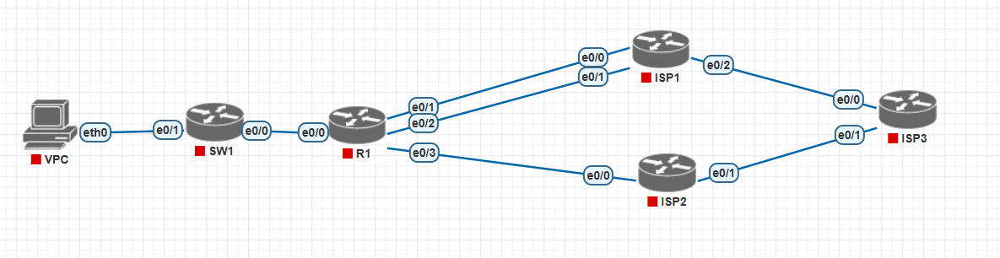

Considerando a topologia do laboratório 06:

- **R1** pertence ao **AS 1000**
- **ISP1** pertence ao **AS 100**
- **ISP2** pertence ao **AS 200**
- **ISP3** pertence ao **AS 300**

Os enlaces considerados são:

- **R1 ↔ ISP1**
  - rede **10.1.0.0/30**
  - rede **10.1.0.4/30**

- **R1 ↔ ISP2**
  - rede **10.2.0.0/30**

- **ISP1 ↔ ISP3**
  - rede **191.1.0.0/30**

- **ISP2 ↔ ISP3**
  - rede **191.2.0.0/30**

Também será utilizada a loopback:

- **ISP1:** `10.10.10.10/32`

E os prefixos externos anunciados por **ISP3**:

- `181.0.0.0/8`
- `182.0.0.0/8`
- `183.0.0.0/8`
- `184.0.0.0/8`
- `185.0.0.0/8`

---

## Procedimentos

### Configuração do ISP3

O **ISP3** representa a rede externa com os prefixos de teste.

---

#### Interfaces do ISP3

```bash
ISP3> enable
ISP3# configure terminal
ISP3(config)# no ip domain lookup
ISP3(config)# interface e0/0
ISP3(config-if)# ip address 191.1.0.2 255.255.255.252
ISP3(config-if)# no shutdown
ISP3(config-if)# interface e0/1
ISP3(config-if)# ip address 191.2.0.2 255.255.255.252
ISP3(config-if)# no shutdown
ISP3(config-if)# interface loopback 1
ISP3(config-if)# ip address 181.0.0.1 255.0.0.0
ISP3(config-if)# interface loopback 2
ISP3(config-if)# ip address 182.0.0.1 255.0.0.0
ISP3(config-if)# interface loopback 3
ISP3(config-if)# ip address 183.0.0.1 255.0.0.0
ISP3(config-if)# interface loopback 4
ISP3(config-if)# ip address 184.0.0.1 255.0.0.0
ISP3(config-if)# interface loopback 5
ISP3(config-if)# ip address 185.0.0.1 255.0.0.0
ISP3(config-if)# end
```

---

#### BGP no ISP3

```bash
ISP3> enable

ISP3# configure terminal

ISP3(config)# router bgp 300

ISP3(config-router)# neighbor 191.1.0.1 remote-as 100

ISP3(config-router)# neighbor 191.1.0.1 password SENHA

ISP3(config-router)# neighbor 191.2.0.1 remote-as 200

ISP3(config-router)# neighbor 191.2.0.1 password SENHA

ISP3(config-router)# network 181.0.0.0 mask 255.0.0.0

ISP3(config-router)# network 182.0.0.0 mask 255.0.0.0

ISP3(config-router)# network 183.0.0.0 mask 255.0.0.0

ISP3(config-router)# network 184.0.0.0 mask 255.0.0.0

ISP3(config-router)# network 185.0.0.0 mask 255.0.0.0

ISP3(config-router)# end
```

---

### Configuração do ISP1

O **ISP1** possui dois enlaces físicos com o **R1**, além de uma loopback usada como vizinho BGP.

---

#### Interfaces do ISP1

```bash
ISP1> enable
ISP1# configure terminal
ISP1(config)# no ip domain lookup
ISP1(config)# interface loopback 0
ISP1(config-if)# ip address 10.10.10.10 255.255.255.255
ISP1(config-if)# no shutdown
ISP1(config-if)# interface e0/0
ISP1(config-if)# ip address 10.1.0.2 255.255.255.252
ISP1(config-if)# no shutdown
ISP1(config-if)# interface e0/1
ISP1(config-if)# ip address 10.1.0.6 255.255.255.252
ISP1(config-if)# no shutdown
ISP1(config-if)# interface e0/2
ISP1(config-if)# ip address 191.1.0.1 255.255.255.252
ISP1(config-if)# no shutdown
ISP1(config-if)# end
```

---

#### BGP no ISP1

```bash
ISP1> enable
ISP1# configure terminal
ISP1(config)# router bgp 100
ISP1(config-router)# neighbor 11.11.11.11 remote-as 1000
ISP1(config-router)# neighbor 11.11.11.11 password SENHA
ISP1(config-router)# neighbor 11.11.11.11 ebgp-multihop 2
ISP1(config-router)# neighbor 11.11.11.11 update-source Loopback0
ISP1(config-router)# neighbor 191.1.0.2 remote-as 300
ISP1(config-router)# neighbor 191.1.0.2 password SENHA
ISP1(config-router)# network 10.10.10.10 mask 255.255.255.255
ISP1(config-router)# exit
ISP1(config)# ip route 11.11.11.11 255.255.255.255 10.1.0.1
ISP1(config)# ip route 11.11.11.11 255.255.255.255 10.1.0.5
ISP1(config)# end
```

---

### Configuração do ISP2

O **ISP2** possui um enlace direto com o **R1** e um enlace com o **ISP3**.

---

#### Interfaces do ISP2

```bash
ISP2> enable
ISP2# configure terminal
ISP2(config)# no ip domain lookup
ISP2(config)# interface e0/0
ISP2(config-if)# ip address 10.2.0.2 255.255.255.252
ISP2(config-if)# no shutdown
ISP2(config-if)# interface e0/1
ISP2(config-if)# ip address 191.2.0.1 255.255.255.252
ISP2(config-if)# no shutdown
ISP2(config-if)# end
```

---

#### BGP no ISP2

```bash
ISP2> enable

ISP2# configure terminal

ISP2(config)# router bgp 200

ISP2(config-router)# neighbor 10.2.0.1 remote-as 1000

ISP2(config-router)# neighbor 10.2.0.1 password SENHA

ISP2(config-router)# neighbor 191.2.0.2 remote-as 300

ISP2(config-router)# neighbor 191.2.0.2 password SENHA

ISP2(config-router)# end
```

---

### Verificação

#### R1

- ```bash
    Router# show ip bgp summary
  ```

  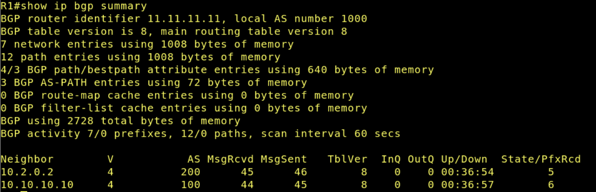

- ```bash
    Router# show ip bgp
  ```

  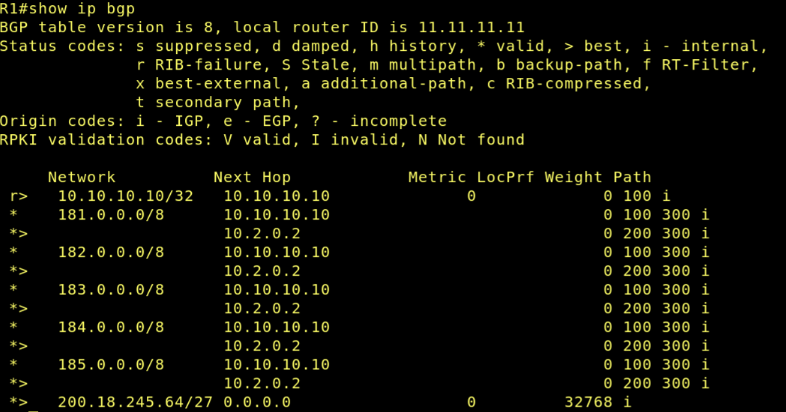

- ```bash
    Router# show ip route
  ```

  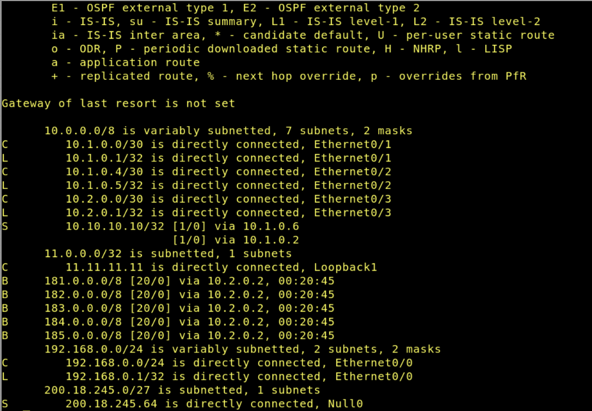

---

#### ISP1

- ```bash
    Router# show ip bgp summary
  ```

  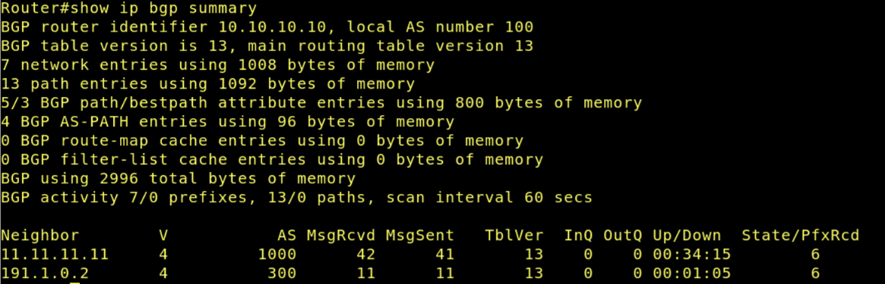

- ```bash
    Router# show ip bgp
  ```

  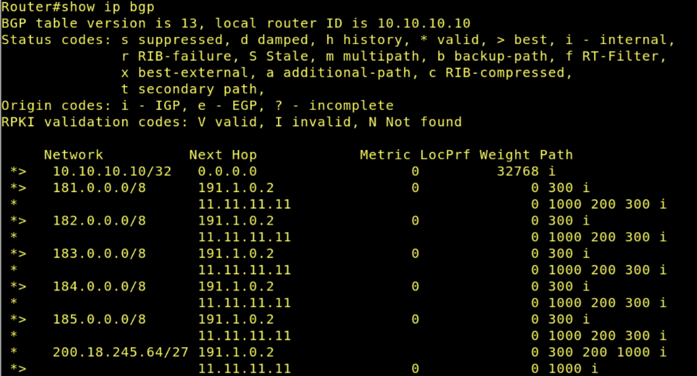

- ```bash
    Router# show ip route
  ```

  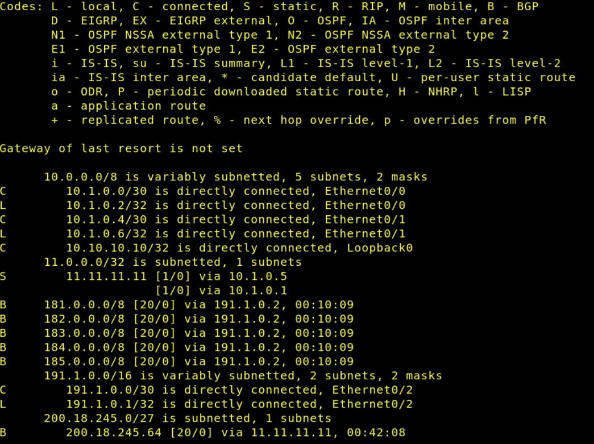

---

#### ISP2

- ```bash
    Router# show ip bgp summary
  ```

  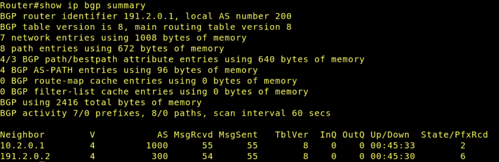

- ```bash
    Router# show ip bgp
  ```

  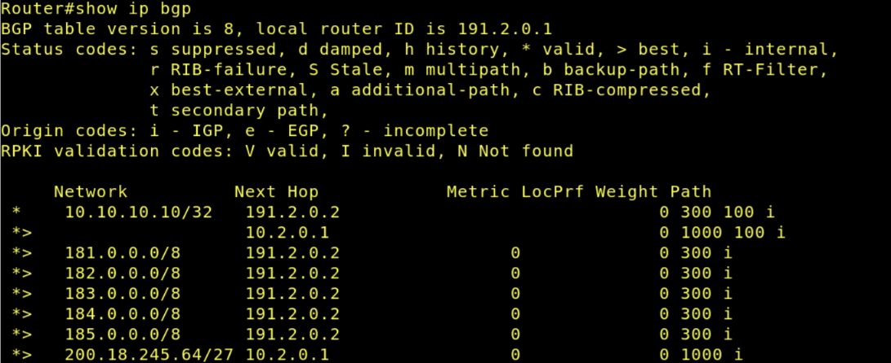

- ```bash
    Router# show ip route
  ```

  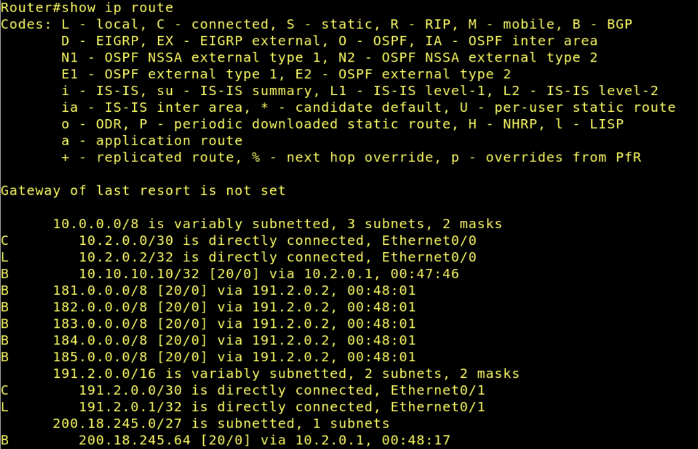

---

#### ISP3

- ```bash
    Router# show ip bgp summary
  ```

  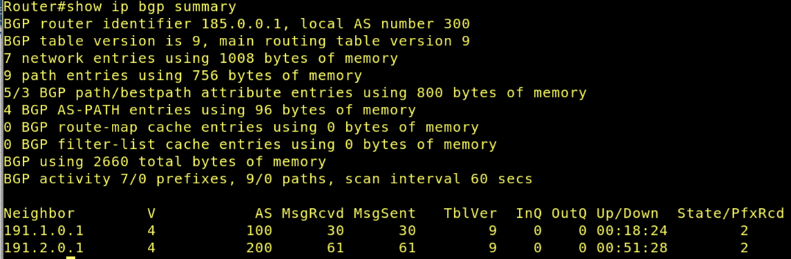

- ```bash
    Router# show ip bgp
  ```

  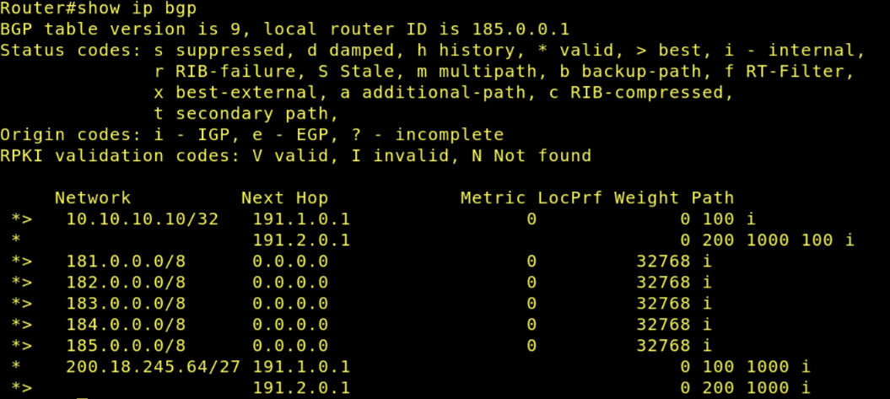

- ```bash
    Router# show ip route
  ```

  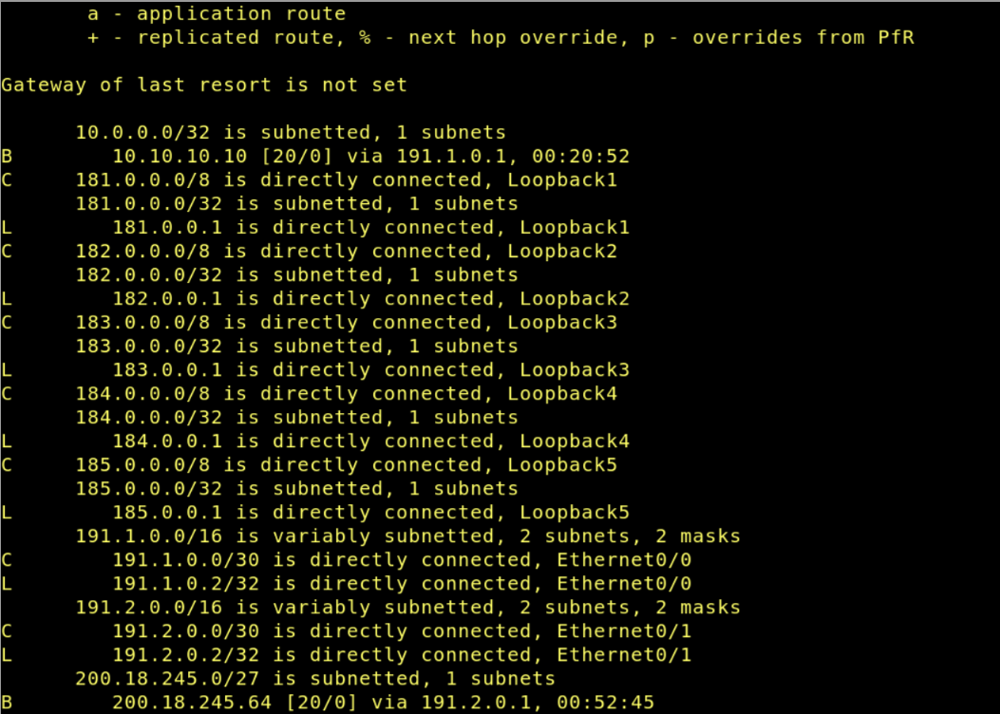
