Disciplina: **ENE0025 – Protocolos de Transporte e Roteamento**  
Curso: **Engenharia de Redes de Comunicação**  
Instituição: **Universidade de Brasília (UnB)**  
Departamento: **Engenharia Elétrica**

Professor Responsável: **Prof. Dr. Laerte Peotta de Melo**

# Relatório do Laboratório 8

## Identificação

- Nome: **Artur Kohara Guerra**
- Matrícula: **231025181**
- Turma: **01**

## Objetivo

Este laboratório tem como objetivo aplicar políticas de roteamento **BGP** e integrar o **BGP** ao **OSPF** no cenário já previamente configurado nos laboratórios 6 e 7, realizando apenas os ajustes específicos para anúncio de prefixos, escolha de caminho preferencial de saída, propagação controlada de rota default e análise de redundância entre provedores.

## Topologia do Laboratório

Visto que este laboratório é uma continuação dos laboratórios 6 e 7, a topologia utilizada é a mesma.


## Procedimentos

As configurações básicas das interfaces e do BGP em cada roteador já foram realizadas nos laboratórios 6 e 7. Logo, neste laboratório, serão realizadas apenas as configurações referentes a:

- **OSPF** no roteador da empresa
- **BGP** no roteador da empresa
- política BGP para preferência de saída
- propagação da rota default no OSPF
- testes de falha e verificação

### Configuração do OSPF interno no R1

O OSPF representa o domínio interno da empresa.

```bash
R1> enable
R1# configure terminal
R1(config)# router ospf 10
R1(config-router)# network 192.168.0.0 0.0.0.255 area 0
R1(config-router)# network 11.11.11.11 0.0.0.0 area 0
R1(config-router)# end
```

### Política BGP: ISP1 como principal, ISP2 como backup

A política abaixo define o **ISP1** como caminho preferencial de saída e o **ISP2** como contingência.

```bash
R1> enable

R1# configure terminal

R1(config)# router bgp 1000

R1(config-router)# neighbor 10.10.10.10 weight 200

R1(config-router)# neighbor 10.2.0.2 weight 100

R1(config-router)# end
```

### Integração entre BGP e OSPF

A integração proposta neste laboratório não redistribui todos os prefixos externos no OSPF. Será propagada apenas a **rota default**, o que representa uma prática mais limpa para o domínio interno.

#### Criar rota default no R1

```bash
R1> enable

R1# configure terminal

R1(config)# ip route 0.0.0.0 0.0.0.0 10.10.10.10

R1(config)# end
```

#### Propagar a rota default no OSPF

```bash
R1> enable

R1# configure terminal

R1(config)# router ospf 10

R1(config-router)# default-information originate

R1(config-router)# end
```

### Verificação no R1

- ```bash
    show ip bgp
  ```

  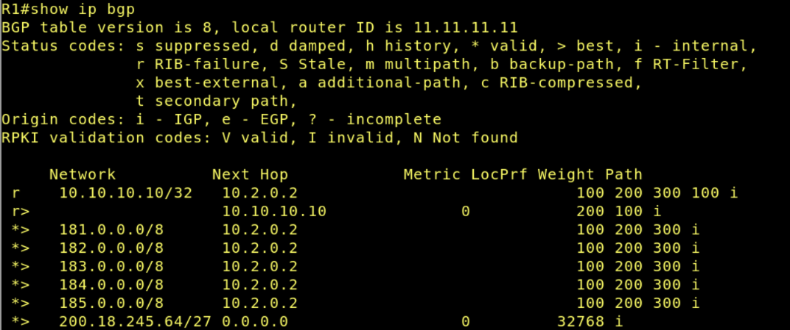

- ```bash
    show ip bgp summary
  ```

  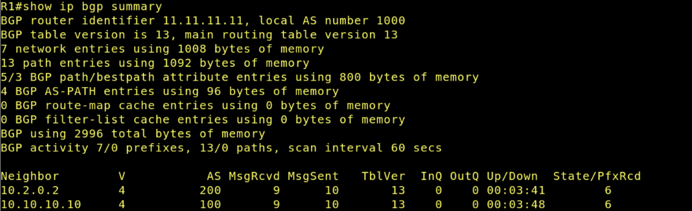

- ```bash
    show ip route
  ```

  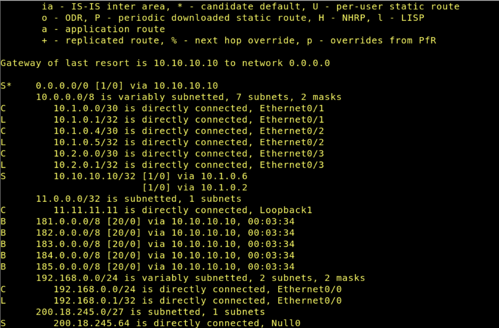

- ```bash
    show ip ospf
  ```

  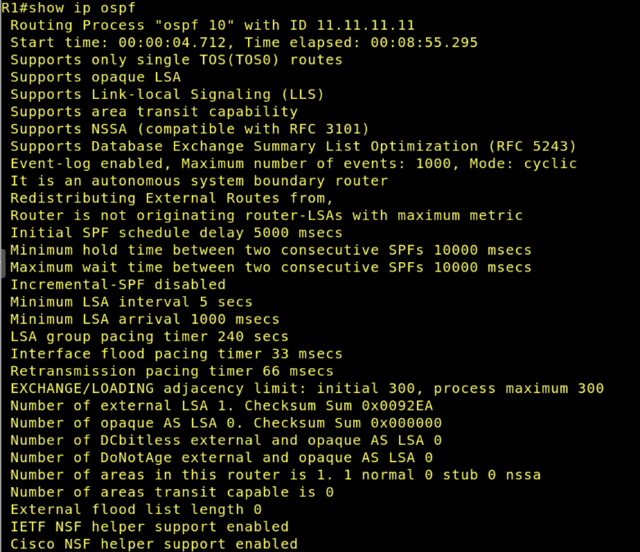
  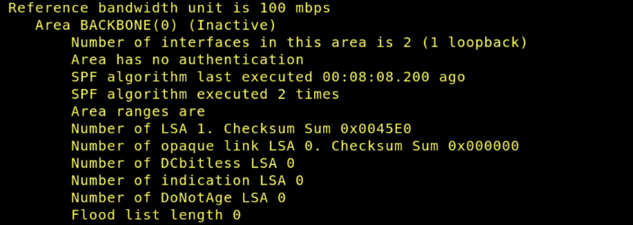

- ```bash
    show ip ospf database
  ```

  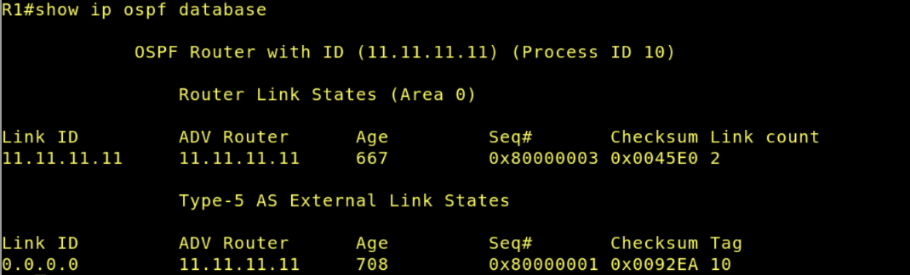

- ```bash
    show ip protocols
  ```

  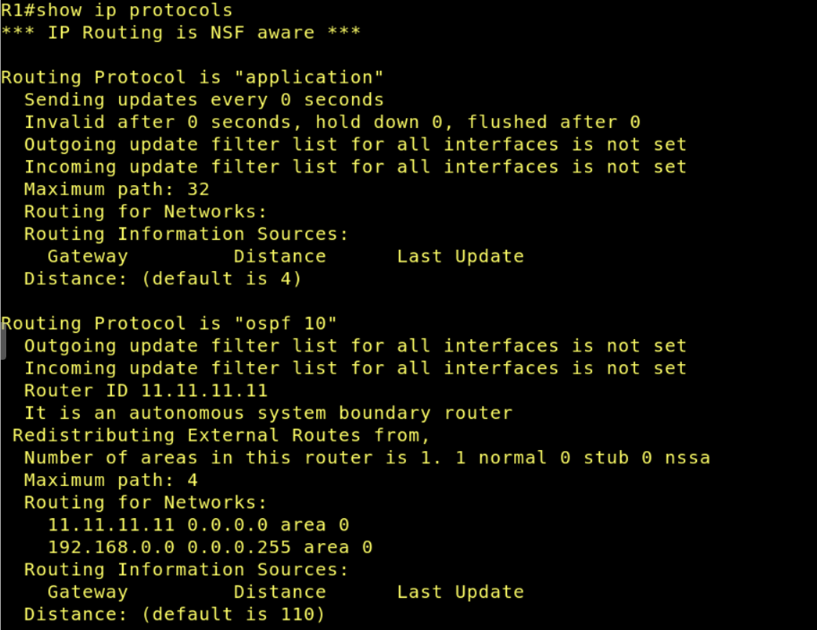
  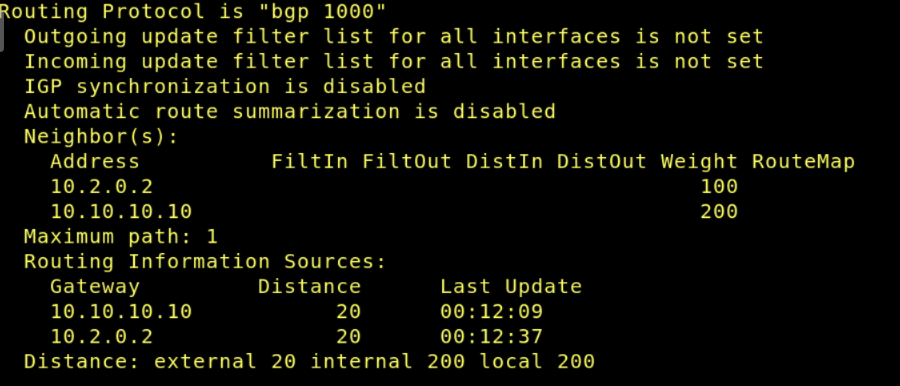

## Teste de falha

Este teste consiste em:

- Desativar um dos enlaces físicos com o **ISP1**
- Observar se a sessão BGP com o ISP1 continua ativa por causa da loopback
- Em seguida, desativar a conectividade total com o **ISP1**
- Verificar se a saída migra para o **ISP2**

### Desativar um enlace físico com o ISP1

- ISP1

  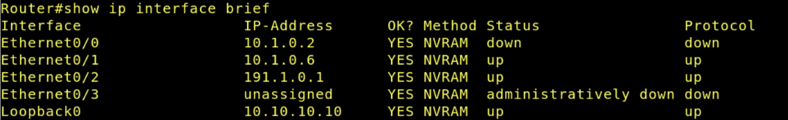

- R1

  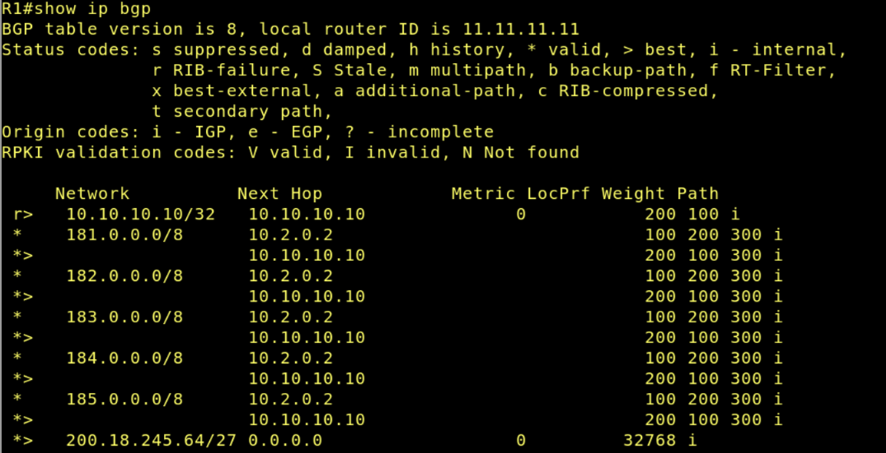

Percebe-se que a comunicação entre o R1 e o ISP1 se manteve ativa e ainda com preferência, uma vez que R1 possui dois enlaces de comunicação com ISP1.

### Desativar conectividade total com o ISP1

- ISP1

  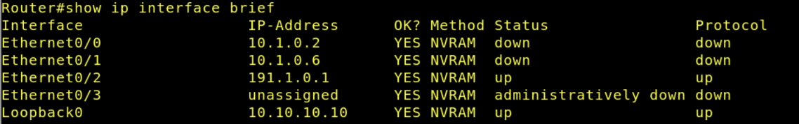

- R1

  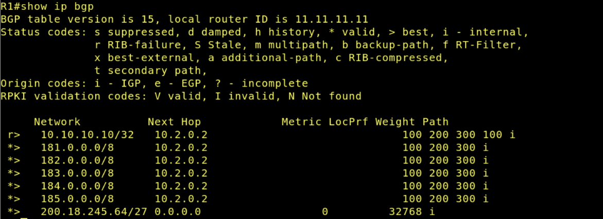

Agora, nota-se que a comunicação entre o R1 e o ISP1 é perdida, levando o roteador a continuar a comunicação por meio do enlace com o ISP2.

## Questões para análise

- **Qual é o papel do OSPF neste laboratório?**

  O OSPF é utilizado para representar o domínio interno da empresa (AS 1000). Seu papel é realizar o roteamento interno entre as redes locais da organização, permitindo que os dispositivos internos aprendam a rota de saída da rede por meio da propagação da rota default. O OSPF é usado apenas internamente, mantendo a separação entre o roteamento interno e o roteamento externo realizado pelo BGP.

- **Qual é o papel do BGP neste laboratório?**

  O BGP é responsável pelo roteamento entre os diferentes Sistemas Autônomos do cenário. Ele permite que a empresa anuncie seu prefixo público `200.18.245.64/27` para os provedores e receba rotas externas da Internet. Além disso, o BGP também é utilizado para aplicar políticas de roteamento, definindo o ISP1 como caminho preferencial e o ISP2 como contingência.

- **Por que o bloco `200.18.245.64/27` é anunciado externamente, mas a rede `192.168.0.0/24` não?**

  O bloco `200.18.245.64/27` representa o prefixo público da empresa, que deve ser acessível externamente pela Internet. Por isso, ele é anunciado via BGP para os provedores. Já a rede `192.168.0.0/24` é uma rede privada interna da empresa e não deve ser roteada publicamente na Internet. Dessa forma, ela permanece restrita ao domínio interno controlado pelo OSPF.

- **Qual a vantagem de formar a sessão BGP com o ISP1 por loopback?**

  A utilização de interfaces de loopback torna a sessão BGP mais estável e resiliente. Como a loopback não depende diretamente de um enlace físico específico, a sessão pode permanecer ativa mesmo que um dos links físicos falhe, desde que ainda exista conectividade IP até a loopback remota. Isso aumenta a redundância e a disponibilidade da comunicação entre os ASs.

- **Qual é a função do comando `update-source Loopback1`?**

  O comando `update-source Loopback1` define que o endereço IP utilizado como origem da sessão BGP será o IP da interface Loopback1 (11.11.11.11) ao invés do endereço IP de uma interface física.

- **Qual é a função do comando `ebgp-multihop 2`?**

  O comando `ebgp-multihop 2` foi necessário pois a sessão eBGP foi estabelecida utilizando interfaces de loopback, que não estão diretamente conectadas fisicamente. Por padrão, o eBGP espera que o vizinho esteja a apenas um salto de distância (TTL = 1), mas, como os pacotes precisam atravessar pelo menos um roteador até alcançar a loopback remota, foi necessário aumentar o TTL permitido para dois saltos.

- **Como verificar, no `show ip bgp`, qual ISP está sendo preferido?**

  No comando `show ip bgp`, é possível verificar qual ISP está sendo preferido observando os valores dos pesos de cada rota na coluna `weight` que aparece, de forma que a rota com o maior peso é selecionada como a melhor.

- **Por que é mais adequado propagar apenas a default route no OSPF?**

  Propagar apenas a rota default mantém o domínio OSPF mais limpo e eficiente. Em vez de inserir diversas rotas externas aprendidas pelo BGP dentro do OSPF, os roteadores internos aprendem apenas que devem encaminhar tráfego desconhecido para o roteador de borda. Isso reduz o tamanho da tabela de roteamento interna e evita sobrecarga desnecessária no protocolo OSPF.

- **O que acontece quando o enlace principal com o ISP1 falha?**

  Quando ocorre falha no enlace principal com o ISP1, o BGP recalcula o melhor caminho disponível. Como o ISP2 também está configurado como vizinho BGP, ele passa a ser utilizado como caminho de saída alternativo. Dessa forma, o ambiente continua operando graças à redundância implementada com múltiplos provedores.

- **Qual a diferença entre usar OSPF para a rede interna e BGP para a borda?**

  O OSPF é um protocolo de roteamento interno (IGP), otimizado para ambientes dentro de uma mesma organização, oferecendo convergência rápida e compartilhamento eficiente de rotas internas. Já o BGP é um protocolo de roteamento externo (EGP), utilizado para troca de rotas entre diferentes Sistemas Autônomos e para aplicação de políticas de roteamento.

## Conclusão

Neste laboratório foi possível compreender a integração entre os protocolos OSPF e BGP em um ambiente com múltiplos Sistemas Autônomos e redundância de provedores. O OSPF foi utilizado para representar o domínio interno da empresa, enquanto o BGP foi empregado na borda da rede para realizar o anúncio do prefixo público da organização e a troca de rotas com os provedores externos.

Além disso, o laboratório permitiu aplicar políticas de roteamento utilizando o atributo weight, definindo o ISP1 como caminho principal de saída e o ISP2 como alternativa. Também foi possível observar, por meio dos testes de falha, o funcionamento do mecanismo de redundância e failover do BGP, garantindo continuidade da conectividade mesmo diante da indisponibilidade do enlace principal.

Outro ponto importante foi a integração controlada entre BGP e OSPF por meio da propagação apenas da rota default no domínio interno. Essa abordagem demonstrou uma prática mais eficiente e organizada, evitando a inserção desnecessária de múltiplas rotas externas dentro do OSPF.

Por fim, o experimento reforçou a diferença de funções entre protocolos de roteamento interno e externo, evidenciando como o OSPF e o BGP atuam de forma complementar para fornecer conectividade, controle de políticas e maior resiliência em ambientes de redes corporativas conectados à Internet.
