Disciplina: **ENE0025 – Protocolos de Transporte e Roteamento**  
Curso: **Engenharia de Redes de Comunicação**  
Instituição: **Universidade de Brasília (UnB)**  
Departamento: **Engenharia Elétrica**

Professor Responsável: **Prof. Dr. Laerte Peotta de Melo**

# Relatório do Laboratório 9

## Identificação

- Nome: **Artur Kohara Guerra**
- Matrícula: **231025181**
- Turma: **01**

---

## Objetivo

Implementar um backbone **MPLS** simplificado na rede do provedor, dando continuidade ao **Lab 8**, de modo a compreender o papel dos roteadores **CE**, **PE** e **P**, habilitar o transporte por rótulos no núcleo da operadora e verificar o funcionamento do backbone MPLS sobre uma infraestrutura previamente estabelecida com **OSPF** e **BGP**.

---

## Topologia do Laboratório

Visto que este laboratório é uma continuação do laboratório 8, a topologia utilizada é a mesma.


---

## Papéis dos roteadores no cenário

| Roteador | Papel no Lab 9 | Descrição                               |
| -------- | -------------- | --------------------------------------- |
| R1       | CE             | Roteador do cliente                     |
| ISP1     | PE             | Borda da operadora conectada ao cliente |
| ISP2     | PE             | Borda da operadora conectada ao cliente |
| ISP3     | P              | Núcleo do backbone da operadora         |

---

## Procedimentos

### Configuração das loopbacks do backbone

- ISP1

  ```bash
  ISP1> enable

  ISP1# configure terminal

  ISP1(config)# interface loopback 1

  ISP1(config-if)# ip address 1.1.1.1 255.255.255.255

  ISP1(config-if)# end
  ```

- ISP2

  ```bash
  ISP2> enable

  ISP2# configure terminal

  ISP2(config)# interface loopback 1

  ISP2(config-if)# ip address 2.2.2.2 255.255.255.255

  ISP2(config-if)# end
  ```

- ISP3

  ```bash
  ISP3> enable

  ISP3# configure terminal

  ISP3(config)# interface loopback 10

  ISP3(config-if)# ip address 3.3.3.3 255.255.255.255

  ISP3(config-if)# end
  ```

---

### OSPF no backbone do provedor

O OSPF foi usado como protocolo interno da operadora.

- ISP1

  ```bash
  ISP1> enable

  ISP1# configure terminal

  ISP1(config)# router ospf 100

  ISP1(config-router)# router-id 1.1.1.1

  ISP1(config-router)# network 191.1.0.0 0.0.0.3 area 0

  ISP1(config-router)# network 1.1.1.1 0.0.0.0 area 0

  ISP1(config-router)# end
  ```

- ISP2

  ```bash
  ISP2> enable

  ISP2# configure terminal

  ISP2(config)# router ospf 100

  ISP2(config-router)# router-id 2.2.2.2

  ISP2(config-router)# network 191.2.0.0 0.0.0.3 area 0

  ISP2(config-router)# network 2.2.2.2 0.0.0.0 area 0

  ISP2(config-router)# end
  ```

- ISP3

  ```bash
  ISP3> enable

  ISP3# configure terminal

  ISP3(config)# router ospf 100

  ISP3(config-router)# router-id 3.3.3.3

  ISP3(config-router)# network 191.1.0.0 0.0.0.3 area 0

  ISP3(config-router)# network 191.2.0.0 0.0.0.3 area 0

  ISP3(config-router)# network 3.3.3.3 0.0.0.0 area 0

  ISP3(config-router)# end
  ```

---

### Habilitação do MPLS no backbone

- ISP1

  ```bash
  ISP1> enable

  ISP1# configure terminal

  ISP1(config)# interface e0/2

  ISP1(config-if)# mpls ip

  ISP1(config-if)# end
  ```

- ISP2

  ```bash
  ISP2> enable

  ISP2# configure terminal

  ISP2(config)# interface e0/1

  ISP2(config-if)# mpls ip

  ISP2(config-if)# end
  ```

- ISP3

  ```bash
  ISP3> enable

  ISP3# configure terminal

  ISP3(config)# interface e0/0

  ISP3(config-if)# mpls ip

  ISP3(config-if)# interface e0/1

  ISP3(config-if)# mpls ip

  ISP3(config-if)# end
  ```

---

### Verificação do backbone OSPF

#### ISP1

- ```bash
    show ip ospf neighbor
  ```

  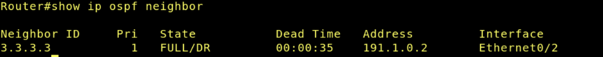

- ```bash
    show ip route
  ```

  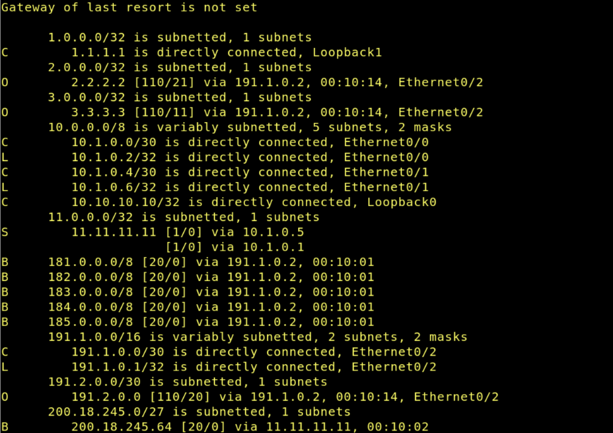

- ```bash
    show ip protocols
  ```

  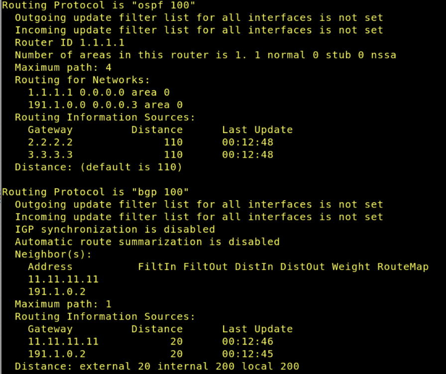

- ```bash
    show ip interface brief
  ```

  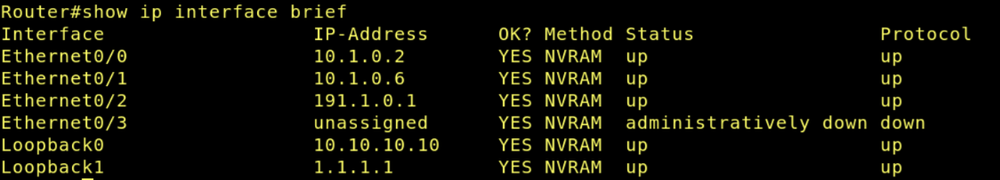

---

#### ISP2

- ```bash
    show ip ospf neighbor
  ```

  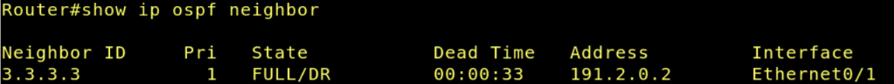

- ```bash
    show ip route
  ```

  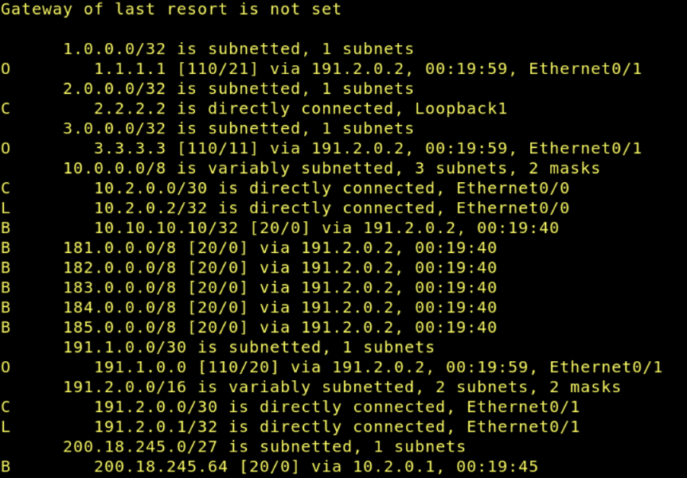

- ```bash
    show ip protocols
  ```

  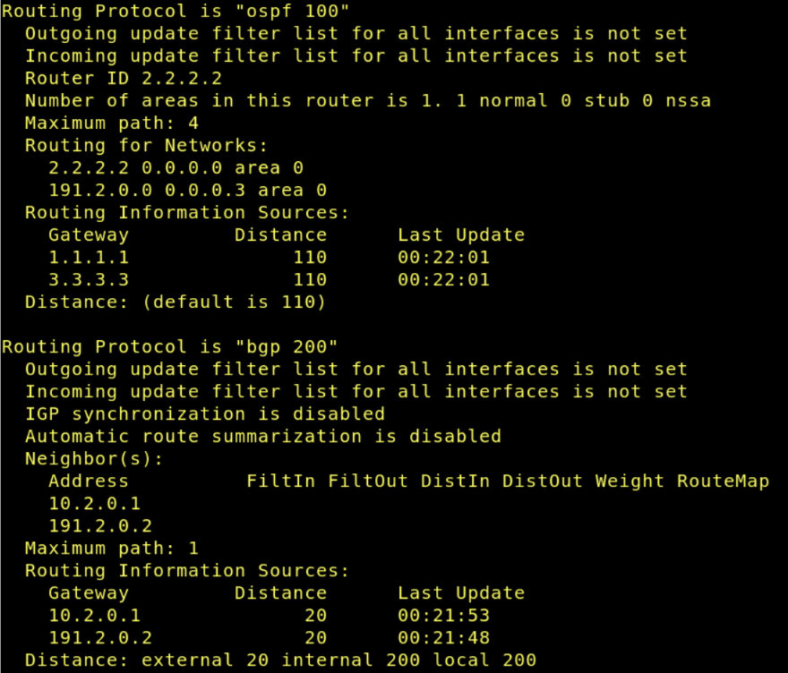

- ```bash
    show ip interface brief
  ```

  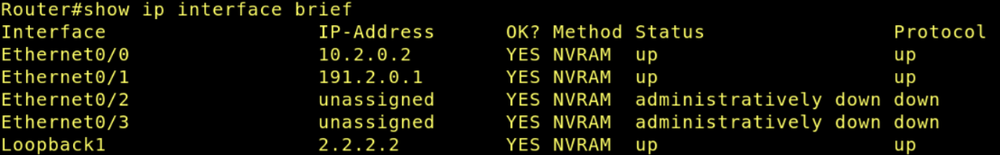

---

#### ISP3

- ```bash
    show ip ospf neighbor
  ```

  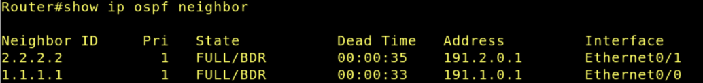

- ```bash
    show ip route
  ```

  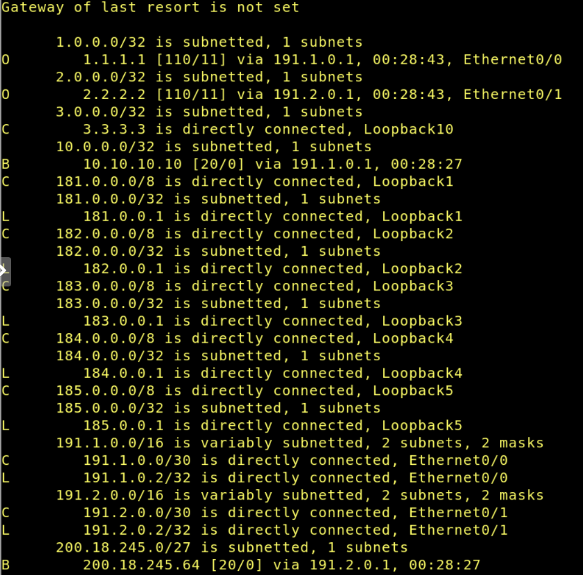

- ```bash
    show ip protocols
  ```

  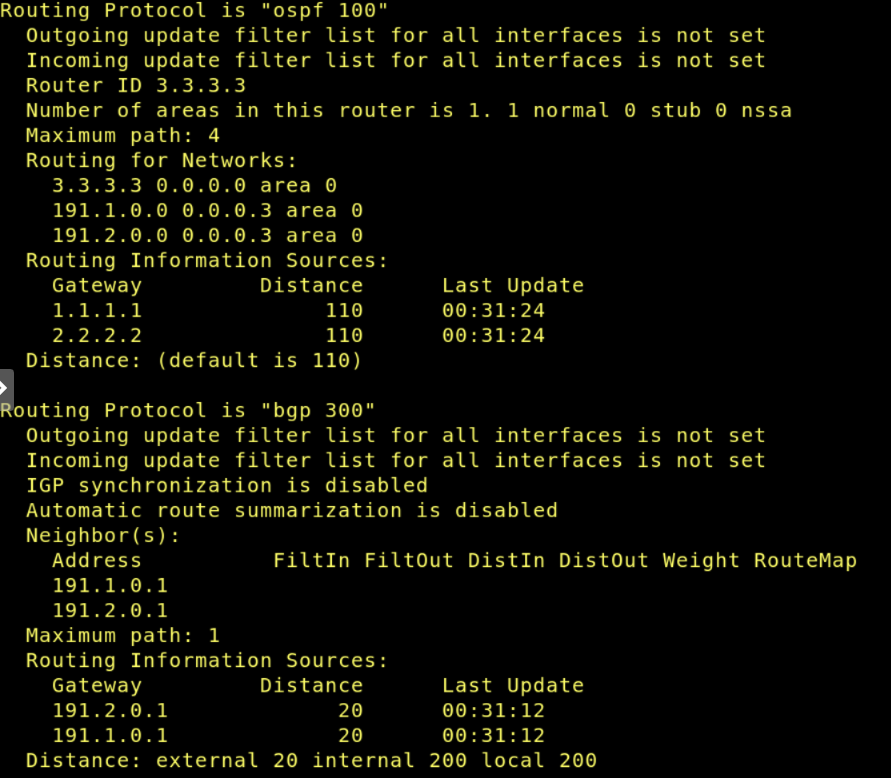

- ```bash
    show ip interface brief
  ```

  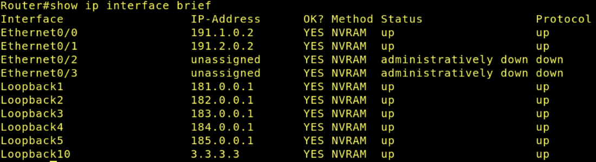

---

### Verificação do MPLS

#### ISP1

- ```bash
    show mpls interfaces
  ```

  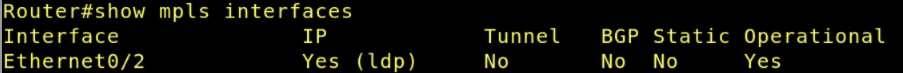

- ```bash
    show mpls ldp neighbor
  ```

  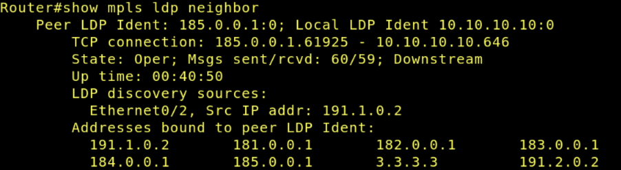

- ```bash
    show mpls forwarding-table
  ```

  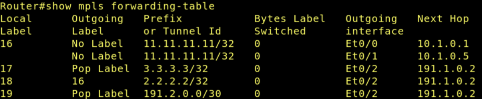

---

#### ISP2

- ```bash
    show mpls interfaces
  ```

  

- ```bash
    show mpls ldp neighbor
  ```

  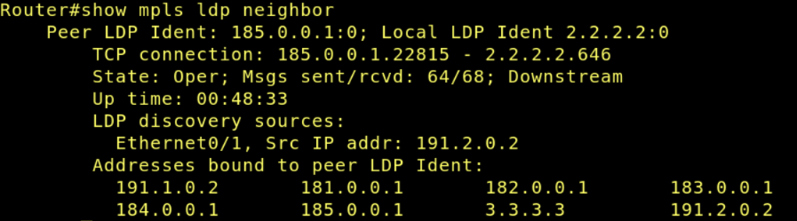

- ```bash
    show mpls forwarding-table
  ```

  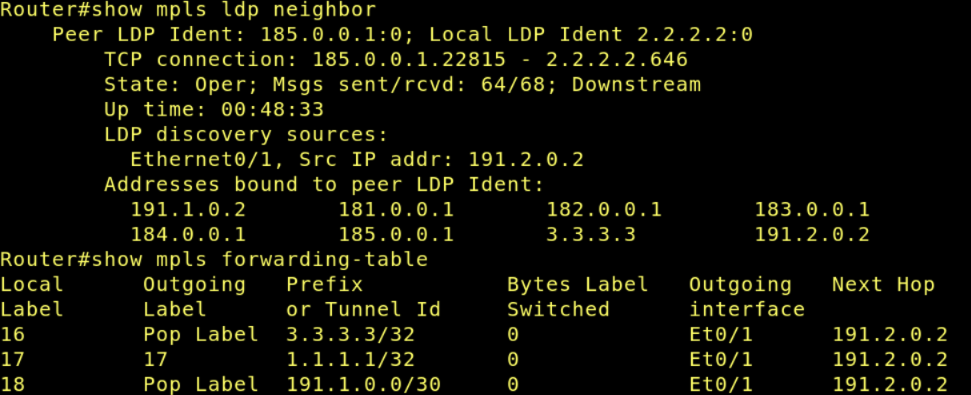

---

#### ISP3

- ```bash
    show mpls interfaces
  ```

  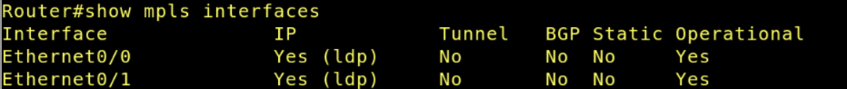

- ```bash
    show mpls ldp neighbor
  ```

  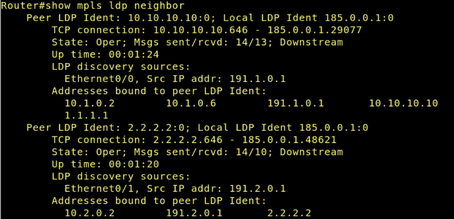

- ```bash
    show mpls forwarding-table
  ```

  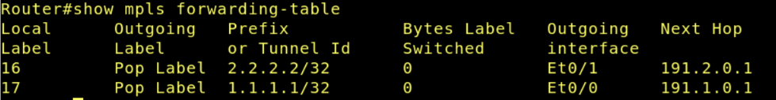

---

## Questões para análise

- **1. Qual é a principal diferença entre roteamento IP tradicional e encaminhamento com MPLS?**

  No roteamento IP tradicional, cada roteador analisa o endereço IP de destino do pacote e consulta sua tabela de roteamento a cada salto para decidir o próximo caminho. Já no MPLS, os pacotes recebem rótulos (labels) e o encaminhamento passa a ser feito com base nesses rótulos.

- **2. Qual é a função do OSPF dentro do backbone do provedor?**

  O OSPF é utilizado como protocolo interno do backbone da operadora para descobrir e manter a alcançabilidade entre os roteadores do núcleo. Ele informa quais caminhos existem entre os roteadores PE e P, permitindo que o MPLS utilize essas rotas para o transporte dos pacotes rotulados.

- **3. Qual é o papel do roteador CE?**

  O roteador CE (Customer Edge) representa o roteador do cliente conectado à operadora. Seu papel é realizar a comunicação entre a rede da empresa e o provedor de serviços. Neste laboratório, o R1 atua como CE, conectando a rede interna da empresa aos roteadores PE da operadora.

- **4. Qual é o papel dos roteadores PE?**

  Os roteadores PE (Provider Edge) fazem a borda da operadora e conectam os clientes ao backbone MPLS. Eles recebem o tráfego vindo do cliente, inserem os rótulos MPLS nos pacotes e encaminham esse tráfego para dentro da nuvem MPLS. Além disso, também participam da troca de rotas com os roteadores dos clientes.

- **5. Qual é o papel do roteador P?**

  O roteador P (Provider) atua no núcleo do backbone MPLS da operadora. Sua principal função é encaminhar pacotes com base nos labels MPLS, sem necessidade de conhecer diretamente as redes dos clientes. Ele participa apenas do transporte interno dentro da nuvem do provedor.

- **6. Por que o cliente normalmente não precisa configurar MPLS no seu roteador?**

  O cliente normalmente não precisa configurar MPLS porque o MPLS funciona internamente na infraestrutura da operadora. Para o roteador do cliente (CE), a comunicação continua parecendo apenas um enlace IP comum. Toda a manipulação dos labels MPLS é realizada pelos roteadores PE e P da operadora.

- **7. Como o Lab 09 complementa o Lab 08?**

  O Lab 08 focava na conectividade entre sistemas autônomos utilizando BGP e integração com OSPF na rede interna da empresa. Já o Lab 09 expande esse cenário ao implementar um backbone MPLS dentro da operadora, mostrando como o tráfego pode ser transportado por labels no núcleo da rede.

- **8. O que significa dizer que o MPLS atua como tecnologia de “camada 2,5”?**

  Dizer que o MPLS atua na “camada 2,5” significa que ele funciona entre a camada de enlace (camada 2) e a camada de rede (camada 3) do modelo OSI. O MPLS adiciona labels aos pacotes antes do encaminhamento IP tradicional, utilizando características intermediárias entre switching e roteamento.

- **9. Por que o backbone precisa de um IGP estável antes da ativação do MPLS?**

  O backbone precisa de um IGP estável, como o OSPF, porque o MPLS depende das rotas IP internas para funcionar corretamente. O IGP é responsável por descobrir os caminhos entre os roteadores do backbone, enquanto o LDP distribui os labels usando essas rotas como base. Sem um protocolo interno funcionando corretamente, o MPLS não consegue estabelecer o encaminhamento por rótulos.

---

## Conclusão

Neste laboratório foi possível compreender a implementação de um backbone baseado em MPLS em um ambiente previamente configurado com BGP e OSPF. A atividade permitiu observar como o MPLS pode ser utilizado no núcleo da operadora para realizar o encaminhamento de pacotes utilizando rótulos, aumentando a escalabilidade e a eficiência do backbone.

Durante o experimento, foram identificados os papéis dos roteadores CE, PE e P, evidenciando a separação entre a rede do cliente e a infraestrutura interna da operadora. Também foi possível verificar que o OSPF continua sendo essencial para garantir a alcançabilidade interna do backbone, enquanto o LDP distribui os labels necessários para o funcionamento do MPLS.

Além disso, os testes realizados com os comandos de verificação permitiram analisar a formação das vizinhanças OSPF e LDP, bem como a criação das tabelas de encaminhamento MPLS. Dessa forma, o laboratório demonstrou como o backbone MPLS complementa a infraestrutura implementada anteriormente com BGP, mostrando uma arquitetura mais próxima das redes utilizadas por operadoras reais.
